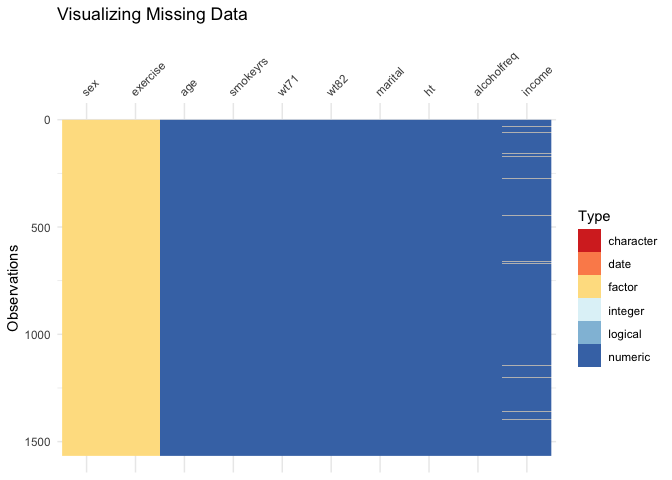
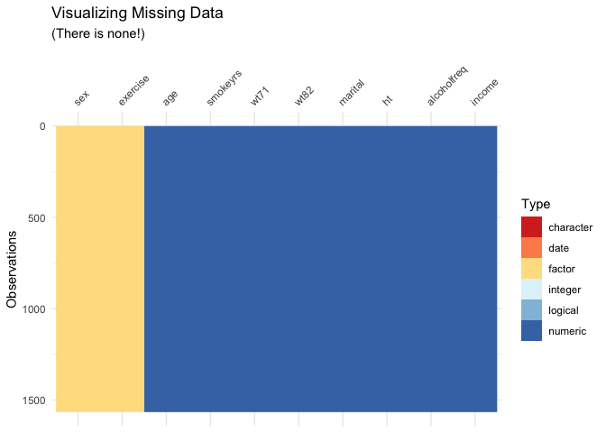
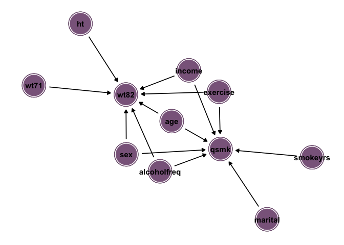
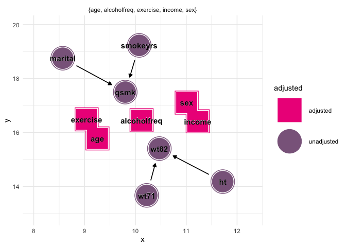
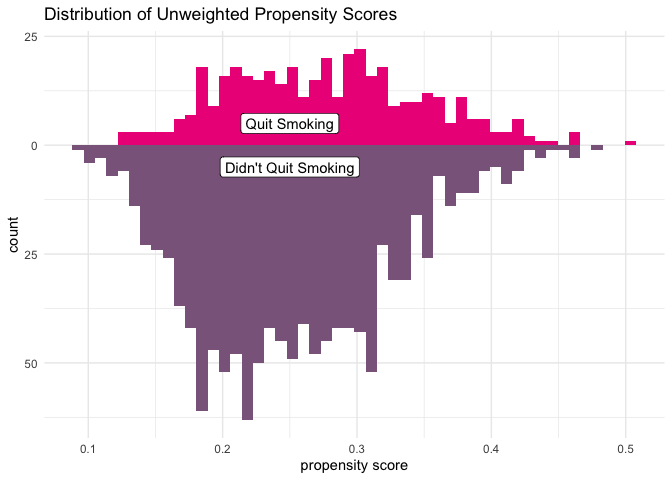
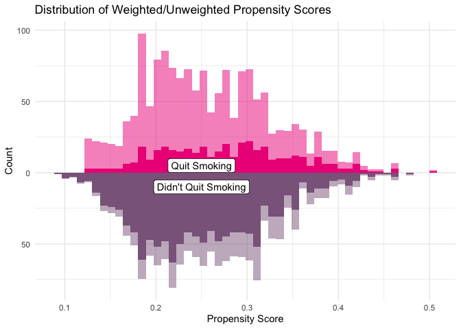
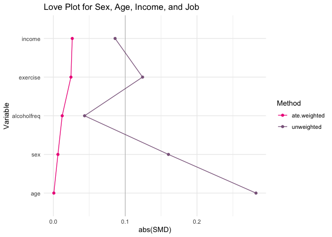
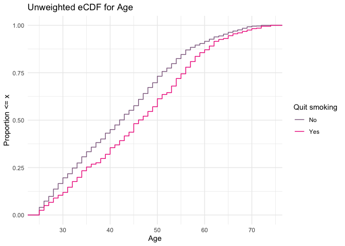
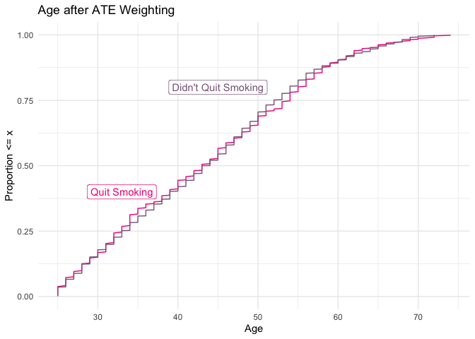
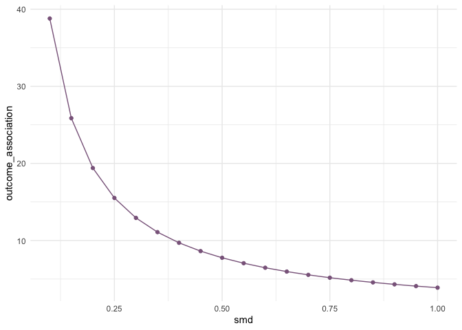

Lab 04 - Whole Game
================
Ellie Grace Moore
2022-03-29

## The Causal Question

We are working with the `nhefs` (National Health and Nutrition
Examination Survey) data set which contains 1629 observations of 67
variables. The variables in this dataset mostly relate to an
individual’s health with a few involving tobacco prices and tax. We are
interested in the effect of quitting smoking on ones weight. More
specifically: **with ones weight in 1971 as the starting point, does
quitting smoking between the years 1971-1982 influence ones weight in
1982?** For this question, we are interested in estimating the average
treatment effect for the overall population. The variables we are
particularly interested in are:

-   **wt71**: weight in kilograms in 1971
-   **age**: age in 1971
-   **sex**: 0: male with 1: female
-   **smokeyrs**: years of smoking
-   **exercise**: In recreation, how much do you exercise? In 1971,
    0:much exercise, 1:moderate exercise, 2:little or no exercise
-   **alcoholfreq**: How often do you drink? In 1971 0: Almost every
    day, 1: 2-3 times/week, 2: 1-4 times/month, 3: &lt; 12 times/year,
    4: No alcohol last year, 5: Unknown
-   **ht**: heigh in cm in 1971
-   **income**: Total family income in 1971 11:&lt;$1000, 12: 1000-1999,
    13: 2000-2999, 14: 3000-3999, 15: 4000-4999, 16: 5000-5999, 17:
    6000-6999, 18: 7000-9999, 19: 10000-14999, 20: 15000-19999, 21:
    20000-24999, 22: 25000+
-   **marital**: Marital status in 1971 1: Under 17, 2: Married, 3:
    Widowed, 4: Never married, 5: Divorced, 6: Separated, 8: Unknown
-   **qsmk** (exposure): quit smoking between 1st questionnaire and
    1982, 1: Yes, 0: No
-   **wt82** (outcome): weight in kilograms in 1982

We start by making a table that shows more about how each of our
variables are distributed.

``` r
nhefs %>%
  tbl_summary(
    by = qsmk, 
    include = c( 
                "wt71",
                "age",
                "sex",
                "smokeyrs",
                "exercise",
                "alcoholfreq",
                "ht",
                "income",
                "marital",
                "qsmk",
                "wt82")) %>%
  add_overall()
```

<div id="doquxzijmt" style="overflow-x:auto;overflow-y:auto;width:auto;height:auto;">
<style>html {
  font-family: -apple-system, BlinkMacSystemFont, 'Segoe UI', Roboto, Oxygen, Ubuntu, Cantarell, 'Helvetica Neue', 'Fira Sans', 'Droid Sans', Arial, sans-serif;
}

#doquxzijmt .gt_table {
  display: table;
  border-collapse: collapse;
  margin-left: auto;
  margin-right: auto;
  color: #333333;
  font-size: 16px;
  font-weight: normal;
  font-style: normal;
  background-color: #FFFFFF;
  width: auto;
  border-top-style: solid;
  border-top-width: 2px;
  border-top-color: #A8A8A8;
  border-right-style: none;
  border-right-width: 2px;
  border-right-color: #D3D3D3;
  border-bottom-style: solid;
  border-bottom-width: 2px;
  border-bottom-color: #A8A8A8;
  border-left-style: none;
  border-left-width: 2px;
  border-left-color: #D3D3D3;
}

#doquxzijmt .gt_heading {
  background-color: #FFFFFF;
  text-align: center;
  border-bottom-color: #FFFFFF;
  border-left-style: none;
  border-left-width: 1px;
  border-left-color: #D3D3D3;
  border-right-style: none;
  border-right-width: 1px;
  border-right-color: #D3D3D3;
}

#doquxzijmt .gt_title {
  color: #333333;
  font-size: 125%;
  font-weight: initial;
  padding-top: 4px;
  padding-bottom: 4px;
  padding-left: 5px;
  padding-right: 5px;
  border-bottom-color: #FFFFFF;
  border-bottom-width: 0;
}

#doquxzijmt .gt_subtitle {
  color: #333333;
  font-size: 85%;
  font-weight: initial;
  padding-top: 0;
  padding-bottom: 6px;
  padding-left: 5px;
  padding-right: 5px;
  border-top-color: #FFFFFF;
  border-top-width: 0;
}

#doquxzijmt .gt_bottom_border {
  border-bottom-style: solid;
  border-bottom-width: 2px;
  border-bottom-color: #D3D3D3;
}

#doquxzijmt .gt_col_headings {
  border-top-style: solid;
  border-top-width: 2px;
  border-top-color: #D3D3D3;
  border-bottom-style: solid;
  border-bottom-width: 2px;
  border-bottom-color: #D3D3D3;
  border-left-style: none;
  border-left-width: 1px;
  border-left-color: #D3D3D3;
  border-right-style: none;
  border-right-width: 1px;
  border-right-color: #D3D3D3;
}

#doquxzijmt .gt_col_heading {
  color: #333333;
  background-color: #FFFFFF;
  font-size: 100%;
  font-weight: normal;
  text-transform: inherit;
  border-left-style: none;
  border-left-width: 1px;
  border-left-color: #D3D3D3;
  border-right-style: none;
  border-right-width: 1px;
  border-right-color: #D3D3D3;
  vertical-align: bottom;
  padding-top: 5px;
  padding-bottom: 6px;
  padding-left: 5px;
  padding-right: 5px;
  overflow-x: hidden;
}

#doquxzijmt .gt_column_spanner_outer {
  color: #333333;
  background-color: #FFFFFF;
  font-size: 100%;
  font-weight: normal;
  text-transform: inherit;
  padding-top: 0;
  padding-bottom: 0;
  padding-left: 4px;
  padding-right: 4px;
}

#doquxzijmt .gt_column_spanner_outer:first-child {
  padding-left: 0;
}

#doquxzijmt .gt_column_spanner_outer:last-child {
  padding-right: 0;
}

#doquxzijmt .gt_column_spanner {
  border-bottom-style: solid;
  border-bottom-width: 2px;
  border-bottom-color: #D3D3D3;
  vertical-align: bottom;
  padding-top: 5px;
  padding-bottom: 5px;
  overflow-x: hidden;
  display: inline-block;
  width: 100%;
}

#doquxzijmt .gt_group_heading {
  padding-top: 8px;
  padding-bottom: 8px;
  padding-left: 5px;
  padding-right: 5px;
  color: #333333;
  background-color: #FFFFFF;
  font-size: 100%;
  font-weight: initial;
  text-transform: inherit;
  border-top-style: solid;
  border-top-width: 2px;
  border-top-color: #D3D3D3;
  border-bottom-style: solid;
  border-bottom-width: 2px;
  border-bottom-color: #D3D3D3;
  border-left-style: none;
  border-left-width: 1px;
  border-left-color: #D3D3D3;
  border-right-style: none;
  border-right-width: 1px;
  border-right-color: #D3D3D3;
  vertical-align: middle;
}

#doquxzijmt .gt_empty_group_heading {
  padding: 0.5px;
  color: #333333;
  background-color: #FFFFFF;
  font-size: 100%;
  font-weight: initial;
  border-top-style: solid;
  border-top-width: 2px;
  border-top-color: #D3D3D3;
  border-bottom-style: solid;
  border-bottom-width: 2px;
  border-bottom-color: #D3D3D3;
  vertical-align: middle;
}

#doquxzijmt .gt_from_md > :first-child {
  margin-top: 0;
}

#doquxzijmt .gt_from_md > :last-child {
  margin-bottom: 0;
}

#doquxzijmt .gt_row {
  padding-top: 8px;
  padding-bottom: 8px;
  padding-left: 5px;
  padding-right: 5px;
  margin: 10px;
  border-top-style: solid;
  border-top-width: 1px;
  border-top-color: #D3D3D3;
  border-left-style: none;
  border-left-width: 1px;
  border-left-color: #D3D3D3;
  border-right-style: none;
  border-right-width: 1px;
  border-right-color: #D3D3D3;
  vertical-align: middle;
  overflow-x: hidden;
}

#doquxzijmt .gt_stub {
  color: #333333;
  background-color: #FFFFFF;
  font-size: 100%;
  font-weight: initial;
  text-transform: inherit;
  border-right-style: solid;
  border-right-width: 2px;
  border-right-color: #D3D3D3;
  padding-left: 5px;
  padding-right: 5px;
}

#doquxzijmt .gt_stub_row_group {
  color: #333333;
  background-color: #FFFFFF;
  font-size: 100%;
  font-weight: initial;
  text-transform: inherit;
  border-right-style: solid;
  border-right-width: 2px;
  border-right-color: #D3D3D3;
  padding-left: 5px;
  padding-right: 5px;
  vertical-align: top;
}

#doquxzijmt .gt_row_group_first td {
  border-top-width: 2px;
}

#doquxzijmt .gt_summary_row {
  color: #333333;
  background-color: #FFFFFF;
  text-transform: inherit;
  padding-top: 8px;
  padding-bottom: 8px;
  padding-left: 5px;
  padding-right: 5px;
}

#doquxzijmt .gt_first_summary_row {
  border-top-style: solid;
  border-top-color: #D3D3D3;
}

#doquxzijmt .gt_first_summary_row.thick {
  border-top-width: 2px;
}

#doquxzijmt .gt_last_summary_row {
  padding-top: 8px;
  padding-bottom: 8px;
  padding-left: 5px;
  padding-right: 5px;
  border-bottom-style: solid;
  border-bottom-width: 2px;
  border-bottom-color: #D3D3D3;
}

#doquxzijmt .gt_grand_summary_row {
  color: #333333;
  background-color: #FFFFFF;
  text-transform: inherit;
  padding-top: 8px;
  padding-bottom: 8px;
  padding-left: 5px;
  padding-right: 5px;
}

#doquxzijmt .gt_first_grand_summary_row {
  padding-top: 8px;
  padding-bottom: 8px;
  padding-left: 5px;
  padding-right: 5px;
  border-top-style: double;
  border-top-width: 6px;
  border-top-color: #D3D3D3;
}

#doquxzijmt .gt_striped {
  background-color: rgba(128, 128, 128, 0.05);
}

#doquxzijmt .gt_table_body {
  border-top-style: solid;
  border-top-width: 2px;
  border-top-color: #D3D3D3;
  border-bottom-style: solid;
  border-bottom-width: 2px;
  border-bottom-color: #D3D3D3;
}

#doquxzijmt .gt_footnotes {
  color: #333333;
  background-color: #FFFFFF;
  border-bottom-style: none;
  border-bottom-width: 2px;
  border-bottom-color: #D3D3D3;
  border-left-style: none;
  border-left-width: 2px;
  border-left-color: #D3D3D3;
  border-right-style: none;
  border-right-width: 2px;
  border-right-color: #D3D3D3;
}

#doquxzijmt .gt_footnote {
  margin: 0px;
  font-size: 90%;
  padding-left: 4px;
  padding-right: 4px;
  padding-left: 5px;
  padding-right: 5px;
}

#doquxzijmt .gt_sourcenotes {
  color: #333333;
  background-color: #FFFFFF;
  border-bottom-style: none;
  border-bottom-width: 2px;
  border-bottom-color: #D3D3D3;
  border-left-style: none;
  border-left-width: 2px;
  border-left-color: #D3D3D3;
  border-right-style: none;
  border-right-width: 2px;
  border-right-color: #D3D3D3;
}

#doquxzijmt .gt_sourcenote {
  font-size: 90%;
  padding-top: 4px;
  padding-bottom: 4px;
  padding-left: 5px;
  padding-right: 5px;
}

#doquxzijmt .gt_left {
  text-align: left;
}

#doquxzijmt .gt_center {
  text-align: center;
}

#doquxzijmt .gt_right {
  text-align: right;
  font-variant-numeric: tabular-nums;
}

#doquxzijmt .gt_font_normal {
  font-weight: normal;
}

#doquxzijmt .gt_font_bold {
  font-weight: bold;
}

#doquxzijmt .gt_font_italic {
  font-style: italic;
}

#doquxzijmt .gt_super {
  font-size: 65%;
}

#doquxzijmt .gt_footnote_marks {
  font-style: italic;
  font-weight: normal;
  font-size: 75%;
  vertical-align: 0.4em;
}

#doquxzijmt .gt_asterisk {
  font-size: 100%;
  vertical-align: 0;
}

#doquxzijmt .gt_slash_mark {
  font-size: 0.7em;
  line-height: 0.7em;
  vertical-align: 0.15em;
}

#doquxzijmt .gt_fraction_numerator {
  font-size: 0.6em;
  line-height: 0.6em;
  vertical-align: 0.45em;
}

#doquxzijmt .gt_fraction_denominator {
  font-size: 0.6em;
  line-height: 0.6em;
  vertical-align: -0.05em;
}
</style>
<table class="gt_table">
  
  <thead class="gt_col_headings">
    <tr>
      <th class="gt_col_heading gt_columns_bottom_border gt_left" rowspan="1" colspan="1"><strong>Characteristic</strong></th>
      <th class="gt_col_heading gt_columns_bottom_border gt_center" rowspan="1" colspan="1"><strong>Overall</strong>, N = 1,566<sup class="gt_footnote_marks">1</sup></th>
      <th class="gt_col_heading gt_columns_bottom_border gt_center" rowspan="1" colspan="1"><strong>0</strong>, N = 1,163<sup class="gt_footnote_marks">1</sup></th>
      <th class="gt_col_heading gt_columns_bottom_border gt_center" rowspan="1" colspan="1"><strong>1</strong>, N = 403<sup class="gt_footnote_marks">1</sup></th>
    </tr>
  </thead>
  <tbody class="gt_table_body">
    <tr><td class="gt_row gt_left">WEIGHT IN KILOGRAMS  IN 1971</td>
<td class="gt_row gt_center">69 (60, 80)</td>
<td class="gt_row gt_center">68 (59, 79)</td>
<td class="gt_row gt_center">71 (61, 81)</td></tr>
    <tr><td class="gt_row gt_left">AGE IN 1971</td>
<td class="gt_row gt_center">43 (33, 53)</td>
<td class="gt_row gt_center">42 (33, 51)</td>
<td class="gt_row gt_center">46 (35, 56)</td></tr>
    <tr><td class="gt_row gt_left">0: MALE 1: FEMALE</td>
<td class="gt_row gt_center"></td>
<td class="gt_row gt_center"></td>
<td class="gt_row gt_center"></td></tr>
    <tr><td class="gt_row gt_left" style="text-align: left; text-indent: 10px;">0</td>
<td class="gt_row gt_center">762 (49%)</td>
<td class="gt_row gt_center">542 (47%)</td>
<td class="gt_row gt_center">220 (55%)</td></tr>
    <tr><td class="gt_row gt_left" style="text-align: left; text-indent: 10px;">1</td>
<td class="gt_row gt_center">804 (51%)</td>
<td class="gt_row gt_center">621 (53%)</td>
<td class="gt_row gt_center">183 (45%)</td></tr>
    <tr><td class="gt_row gt_left">YEARS OF SMOKING</td>
<td class="gt_row gt_center">24 (15, 33)</td>
<td class="gt_row gt_center">23 (15, 32)</td>
<td class="gt_row gt_center">26 (15, 35)</td></tr>
    <tr><td class="gt_row gt_left">IN RECREATION, HOW MUCH EXERCISE? IN 1971, 0:much exercise,1:moderate exercise,2:little or no exercise</td>
<td class="gt_row gt_center"></td>
<td class="gt_row gt_center"></td>
<td class="gt_row gt_center"></td></tr>
    <tr><td class="gt_row gt_left" style="text-align: left; text-indent: 10px;">0</td>
<td class="gt_row gt_center">300 (19%)</td>
<td class="gt_row gt_center">237 (20%)</td>
<td class="gt_row gt_center">63 (16%)</td></tr>
    <tr><td class="gt_row gt_left" style="text-align: left; text-indent: 10px;">1</td>
<td class="gt_row gt_center">661 (42%)</td>
<td class="gt_row gt_center">485 (42%)</td>
<td class="gt_row gt_center">176 (44%)</td></tr>
    <tr><td class="gt_row gt_left" style="text-align: left; text-indent: 10px;">2</td>
<td class="gt_row gt_center">605 (39%)</td>
<td class="gt_row gt_center">441 (38%)</td>
<td class="gt_row gt_center">164 (41%)</td></tr>
    <tr><td class="gt_row gt_left">HOW OFTEN DO YOU DRINK?  IN 1971  0: Almost every day, 1: 2-3 times/week, 2: 1-4 times/month, 3: &lt; 12 times/year, 4: No alcohol last year, 5: Unknown</td>
<td class="gt_row gt_center"></td>
<td class="gt_row gt_center"></td>
<td class="gt_row gt_center"></td></tr>
    <tr><td class="gt_row gt_left" style="text-align: left; text-indent: 10px;">0</td>
<td class="gt_row gt_center">325 (21%)</td>
<td class="gt_row gt_center">242 (21%)</td>
<td class="gt_row gt_center">83 (21%)</td></tr>
    <tr><td class="gt_row gt_left" style="text-align: left; text-indent: 10px;">1</td>
<td class="gt_row gt_center">219 (14%)</td>
<td class="gt_row gt_center">171 (15%)</td>
<td class="gt_row gt_center">48 (12%)</td></tr>
    <tr><td class="gt_row gt_left" style="text-align: left; text-indent: 10px;">2</td>
<td class="gt_row gt_center">494 (32%)</td>
<td class="gt_row gt_center">359 (31%)</td>
<td class="gt_row gt_center">135 (33%)</td></tr>
    <tr><td class="gt_row gt_left" style="text-align: left; text-indent: 10px;">3</td>
<td class="gt_row gt_center">328 (21%)</td>
<td class="gt_row gt_center">249 (21%)</td>
<td class="gt_row gt_center">79 (20%)</td></tr>
    <tr><td class="gt_row gt_left" style="text-align: left; text-indent: 10px;">4</td>
<td class="gt_row gt_center">195 (12%)</td>
<td class="gt_row gt_center">138 (12%)</td>
<td class="gt_row gt_center">57 (14%)</td></tr>
    <tr><td class="gt_row gt_left" style="text-align: left; text-indent: 10px;">5</td>
<td class="gt_row gt_center">5 (0.3%)</td>
<td class="gt_row gt_center">4 (0.3%)</td>
<td class="gt_row gt_center">1 (0.2%)</td></tr>
    <tr><td class="gt_row gt_left">HEIGHT IN CENTIMETERS IN 1971</td>
<td class="gt_row gt_center">168 (162, 175)</td>
<td class="gt_row gt_center">168 (162, 175)</td>
<td class="gt_row gt_center">169 (162, 176)</td></tr>
    <tr><td class="gt_row gt_left">TOTAL FAMILY INCOME IN 1971  11:&lt;$1000, 12: 1000-1999, 13: 2000-2999, 14: 3000-3999, 15: 4000-4999, 16: 5000-5999, 17: 6000-6999, 18: 7000-9999, 19: 10000-14999, 20: 15000-19999, 21: 20000-24999, 22: 25000+</td>
<td class="gt_row gt_center">19.0 (17.0, 20.0)</td>
<td class="gt_row gt_center">19.0 (16.8, 20.0)</td>
<td class="gt_row gt_center">19.0 (18.0, 20.0)</td></tr>
    <tr><td class="gt_row gt_left" style="text-align: left; text-indent: 10px;">Unknown</td>
<td class="gt_row gt_center">59</td>
<td class="gt_row gt_center">35</td>
<td class="gt_row gt_center">24</td></tr>
    <tr><td class="gt_row gt_left">MARITAL STATUS IN 1971  1: Under 17, 2: Married, 3: Widowed, 4: Never married, 5: Divorced, 6: Separated, 8: Unknown</td>
<td class="gt_row gt_center"></td>
<td class="gt_row gt_center"></td>
<td class="gt_row gt_center"></td></tr>
    <tr><td class="gt_row gt_left" style="text-align: left; text-indent: 10px;">2</td>
<td class="gt_row gt_center">1,237 (79%)</td>
<td class="gt_row gt_center">906 (78%)</td>
<td class="gt_row gt_center">331 (82%)</td></tr>
    <tr><td class="gt_row gt_left" style="text-align: left; text-indent: 10px;">3</td>
<td class="gt_row gt_center">88 (5.6%)</td>
<td class="gt_row gt_center">64 (5.5%)</td>
<td class="gt_row gt_center">24 (6.0%)</td></tr>
    <tr><td class="gt_row gt_left" style="text-align: left; text-indent: 10px;">4</td>
<td class="gt_row gt_center">93 (5.9%)</td>
<td class="gt_row gt_center">74 (6.4%)</td>
<td class="gt_row gt_center">19 (4.7%)</td></tr>
    <tr><td class="gt_row gt_left" style="text-align: left; text-indent: 10px;">5</td>
<td class="gt_row gt_center">92 (5.9%)</td>
<td class="gt_row gt_center">74 (6.4%)</td>
<td class="gt_row gt_center">18 (4.5%)</td></tr>
    <tr><td class="gt_row gt_left" style="text-align: left; text-indent: 10px;">6</td>
<td class="gt_row gt_center">55 (3.5%)</td>
<td class="gt_row gt_center">45 (3.9%)</td>
<td class="gt_row gt_center">10 (2.5%)</td></tr>
    <tr><td class="gt_row gt_left" style="text-align: left; text-indent: 10px;">8</td>
<td class="gt_row gt_center">1 (&lt;0.1%)</td>
<td class="gt_row gt_center">0 (0%)</td>
<td class="gt_row gt_center">1 (0.2%)</td></tr>
    <tr><td class="gt_row gt_left">WEIGHT IN KILOGRAMS  IN 1982</td>
<td class="gt_row gt_center">72 (62, 83)</td>
<td class="gt_row gt_center">70 (61, 82)</td>
<td class="gt_row gt_center">75 (64, 86)</td></tr>
  </tbody>
  
  <tfoot class="gt_footnotes">
    <tr>
      <td class="gt_footnote" colspan="4"><sup class="gt_footnote_marks">1</sup> Median (IQR); n (%)</td>
    </tr>
  </tfoot>
</table>
</div>

## Missing Data

Before we can begin our causal assessment, we must investigate any
missing data. To do this, we create a plot that helps us visualize any
missing data:

``` r
nhefs %>% 
  select(sex, age, smokeyrs, wt71, wt82, marital, ht, alcoholfreq, exercise, income) %>% vis_dat(palette = "cb_safe") +
  ggtitle("Visualizing Missing Data")
```



It appears that the only variables that has missing values is income.
With this being said, we will conduct a predictive mean matching
imputation method in order to impute these missing values. We also
recreate the above plot to ensure that there are no longer missing data.

``` r
nhefs_imp <- mice(nhefs, m = 1, method = "pmm", printFlag = FALSE) #single imputation
complete_data <- complete(nhefs_imp)

complete_data %>% 
   select(sex, age, smokeyrs, wt71, wt82, marital, ht, alcoholfreq, exercise, income) %>% vis_dat(palette = "cb_safe") + 
  ggtitle("Visualizing Missing Data", subtitle = "(There is none!)")
```



## Proposed DAG

We now have a complete dataset. To begin, we specify relationships for
our exposure and outcome along with the other variables. Our proposed
DAG is below.

``` r
dag <- dagify(
wt82 ~ wt71 + sex + age + exercise + ht + alcoholfreq + income,
qsmk ~ age + sex + smokeyrs + alcoholfreq + exercise + marital + income, 
  exposure = "qsmk", 
  outcome = "wt82"
) 
dag %>%
  ggdag() + 
  geom_dag_node(color = "plum4") + 
  geom_dag_text(color = "black") +
  theme_dag() 
```



To prevent confounders, we need to close the backdoor paths on our DAG.
To do this, we establish the adjustment set and adjust for those
specified variables.

``` r
dag %>%
  ggdag_adjustment_set(stylized = TRUE) +
  geom_dag_text(color = "black") +
  scale_color_manual(values = c("deeppink2", "plum4")) +
  theme_minimal()
```



From the figure above, we can see that we need to adjust for age,
alcoholfreq, exercise, income, and sex. These will therefore be the
variables we include in our propensity score model.

## Propensity Score Model

We adjust for the above-listed variables by using a binomial model for
our propensity scores. After specifying our model, we create a mirrored
histogram of the calculatede propensity scores for both quitting and not
quitting smoking.

``` r
complete_data <- 
  glm(qsmk ~ age + sex + income + exercise + alcoholfreq,
    data = complete_data,
    family = binomial()) %>%
  augment(type.predict = "response", data = complete_data) 

df_plot_ps <- complete_data %>%
  tidyr::pivot_wider(names_from = qsmk, 
                     values_from = .fitted, 
                     names_prefix = "qsmk_p")

ggplot(df_plot_ps) +
  geom_histogram(bins = 50, 
                 aes(x = qsmk_p1), 
                 fill = "deeppink2") + 
  geom_histogram(bins = 50, 
                 aes(x = qsmk_p0, 
                     y = - stat(count)), 
                 fill = "plum4") + 
  
  scale_y_continuous("count", label = abs) + 
  scale_x_continuous("propensity score") +
  annotate(geom = "label",
           x = 0.25,
           y= 5,
           label = "Quit Smoking") + 
annotate(geom = "label",
         x = 0.25,
         y = -5,
         label  = "Didn't Quit Smoking") +
  ggtitle("Distribution of Unweighted Propensity Scores") +
  theme_minimal()
```


The first observation we can make is that most people did not quit
smoking. Also, we notice that those who did not quit smoking all had a
relatively low probability for quitting, so the model did a good job
here. However, for those who did quit smoking, there is more of a range
of probabilities with a huddle around 0.2-0.3 range. We will now create
a *weighted* mirrored histogram using weights for the average treatment
effect.

``` r
complete_data <- complete_data %>%
  mutate( 
    w_ate = qsmk / .fitted + 
      (1 - qsmk) / (1 - .fitted)
  )

df_plot_ps <- complete_data %>%
  tidyr::pivot_wider(names_from = qsmk, 
                     values_from = .fitted, 
                     names_prefix = "qsmk_p")

ggplot(df_plot_ps) +
  geom_histogram(bins = 50,
                 aes(x = qsmk_p1), 
                 fill = "deeppink2") + 
  geom_histogram(bins = 50, 
                 aes(x = qsmk_p1,
                     weight = w_ate), 
                 fill = "deeppink2",
                 alpha = 0.5) +

  geom_histogram(bins = 50, 
                 aes(x = qsmk_p0, 
                     y = - stat(count)),
                 fill = "plum4") + 
  geom_histogram(bins = 50,
                 aes(x = qsmk_p0, 
                     weight = w_ate, 
                     y = - stat(count)), 
                 fill = "plum4",
                 alpha = 0.5) + 
  
  scale_y_continuous("Count", label = abs) + 
  scale_x_continuous("Propensity Score") +
  annotate(geom = "label",
           x = 0.25,
           y= 5,
           label = "Quit Smoking") +
annotate(geom = "label",
         x = 0.25,
         y = -10,
         label  = "Didn't Quit Smoking") + 
  ggtitle("Distribution of Weighted/Unweighted Propensity Scores") + 
  theme_minimal()
```



### Checking the Model

We will now look at scaled mean differences (smd’s) and empirical CDF’s
in order to determine if we need to reiterate our model with any
polynomial or spline terms. We begin by looking at a love plot that
shows the smd’s for each variable.

``` r
smds <- complete_data %>%
  summarize(
    across(c(age, sex, exercise, alcoholfreq, income),
           list(unweighted = ~smd(.x, qsmk)$estimate,
                ate.weighted = ~smd(.x, qsmk, w = w_ate)$estimate))
  )

plot_df <- smds %>%
  pivot_longer(
    everything(),
    values_to = "SMD",
    names_to = c("Variable", "Method"),
    names_pattern = "(.*)_(.*)"
  ) %>%
  arrange(Method, abs(SMD)) %>%
  mutate(Variable = fct_inorder(Variable))

ggplot(
  data = plot_df,
  aes(x = abs(SMD), y = Variable, 
      group = Method, color = Method)
) +  
  geom_line(orientation = "y") +
  geom_point() + 
  geom_vline(xintercept = 0.1, 
             color = "black", size = 0.1) +
  ggtitle("Love Plot for Sex, Age, Income, and Job") + 
  scale_color_manual(values = c("deeppink2", "plum4")) + 
  theme_minimal()
```



According to this plot, changes to our propensity score model are not
necessary since each scaled mean difference is below the specified value
of 0.1. Next we look at an unweighted eCDF for age (since it is the only
continuous variable).

``` r
ggplot(complete_data, 
       aes(x = age, group = qsmk, 
           color = factor(qsmk))) +
  stat_ecdf() +
  scale_color_manual("Quit smoking", 
                     values = c("plum4", "deeppink2"),
                     labels = c("No", "Yes")) + 
  scale_x_continuous("Age") + 
  ylab("Proportion <= x") + 
  ggtitle("Unweighted eCDF for Age") +
  theme_minimal()
```



This eCDF is not bad, however the distributions could line up better in
the middle. Let us now create a **weighted** eCDF (again, with our ATE
weights) to see if we can get these to line up better.

``` r
ecdf_1 <- complete_data %>%
  filter(qsmk == 1) %>%
  arrange(age) %>%
  mutate(cum_pct = cumsum(w_ate) / sum(w_ate))

ecdf_0 <- complete_data %>%
  filter(qsmk == 0) %>%
  arrange(age) %>%
  mutate(cum_pct = cumsum(w_ate) / sum(w_ate))

ggplot(ecdf_1, aes(x = age, y = cum_pct)) +
  geom_line(color = "deeppink2") +
  geom_line(data = ecdf_0, 
            aes(x = age, y = cum_pct), 
            color = "plum4") + 
  xlab("Age") + 
  ylab("Proportion <= x") + 
  ggtitle("Age after ATE Weighting") +
annotate(geom = "label",
         x = 45,
         y = 0.8,
         color = "plum4",
         label = "Didn't Quit Smoking") +
annotate(geom = "label",
         x = 33,
         y = 0.4,
         color = "deeppink2",
         label = "Quit Smoking") +
  theme_minimal()
```



This weighted eCDF looks much better! After looking at the love plot and
weighted eCDF, we can conclude that we do not need to iterate our
propensity score model.

## The Effect

``` r
ATE <- complete_data %>% 
  summarise((sum(qsmk*wt82*w_ate)/sum(qsmk*w_ate))-(sum((1-qsmk)*wt82*w_ate)/sum((1-qsmk)*w_ate))); ATE
```

    ## # A tibble: 1 × 1
    ##   `(sum(qsmk * wt82 * w_ate) / sum(qsmk * w_ate)) - ...`
    ##                                                    <dbl>
    ## 1                                                   3.96

We see that our estimated ATE is 3.96. This means that if someone quit
smoking between 1971-1982, then they weighed approximately 3.96 kg more
than someone who did not quit smoking. This does give us insight as to
the causal relationship between quitting smoking and weight, but we will
calculate uncertainty estimates and bootstrapped intervals in order to
get an even better idea on the causal effect.

### Uncertainty Estimates

``` r
bootstrap <- bootstraps(complete_data, 1000, apparent = TRUE) %>%
  mutate(df = map(splits, analysis))

fit_ipw <- function(split, ...) {
  .df <- analysis(split)
  # fit propensity score model
  propensity_model <- glm(
    qsmk ~ age + exercise + income + sex + alcoholfreq,
    family = binomial(), 
    data = .df
  )
  # calculate inverse probability weights
  .df <- propensity_model %>% 
    augment(type.predict = "response", data = .df) %>% 
    mutate(wts = qsmk / .fitted + (1 - qsmk) / (1  - .fitted)) 
  # fit correctly bootsrapped ipw model
  lm(wt82 ~ qsmk, data = .df, weights = wts) %>% 
    tidy()
}

estimate <- array()
std_error <- array()
for (i in 1:1000) {
    estimate[i] = fit_ipw(bootstrap$splits[[i]])[2,] %>% pull("estimate")
    std_error[i] = fit_ipw(bootstrap$splits[[i]])[2,] %>% pull("std.error")
}

estimates <- data.frame(estimate, std_error)
quantile(estimates$estimate, probs = c(0.025, 0.975))
```

    ##     2.5%    97.5% 
    ## 2.065178 5.607730

``` r
quantile(estimates$std_error, probs = c(0.025, 0.975))
```

    ##      2.5%     97.5% 
    ## 0.7832907 0.8674608

From the code above, we can see that a 95% confidence interval for our
ATE estimate is (2.065, 5.608) with standard error (0.783, 0.867).

## Sensitivity Analysis

``` r
smd <- c(.1, .15, .2, .25, .3, .35, .4, .45, .5, .55, .6, .65, .7, .75, .8, .85, .9, .95, 1)
adjust_coef(effect = 3.88,
            smd = smd,
            outcome_association = 3.88 / smd,
            verbose = FALSE) %>%
  ggplot(aes(x = smd, y = outcome_association)) +
  geom_line(color = "plum4") +
  geom_point(color = "plum4") +
  theme_minimal()
```



``` r
tip_lm(effect = 3.88,
        smd = 0.5)
```

    ## # A tibble: 1 × 4
    ##   observed_effect   smd outcome_association n_unmeasured_confounders
    ##             <dbl> <dbl>               <dbl>                    <dbl>
    ## 1            3.88   0.5                7.76                        1
