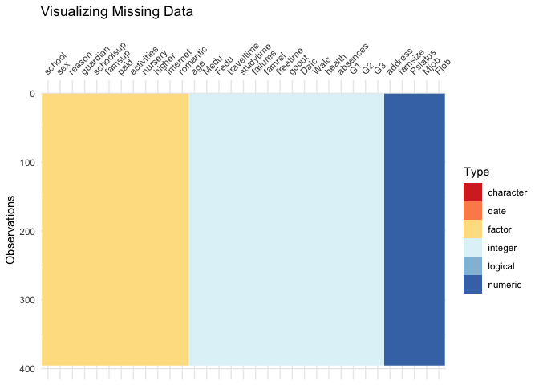
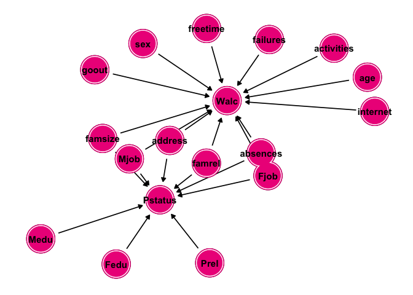
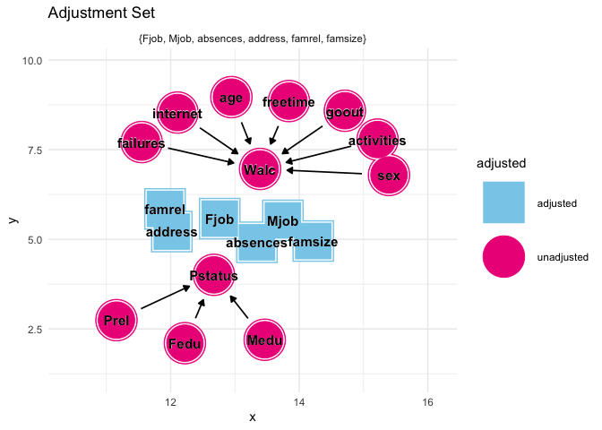
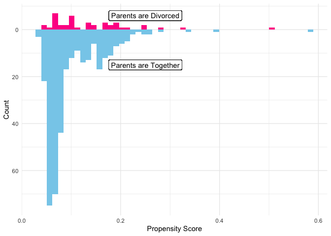
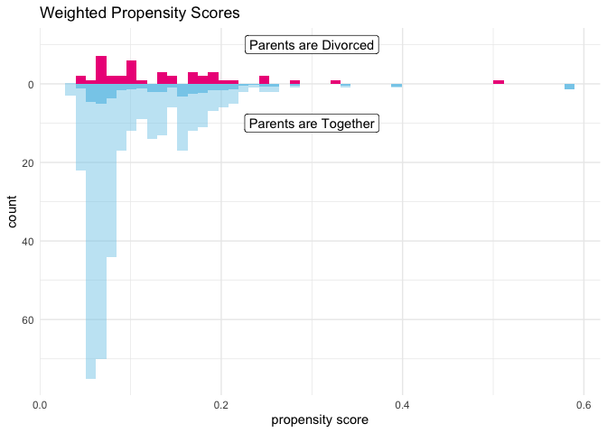
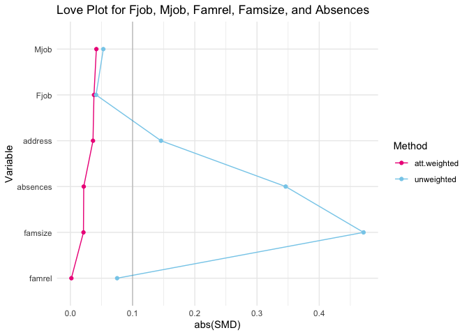
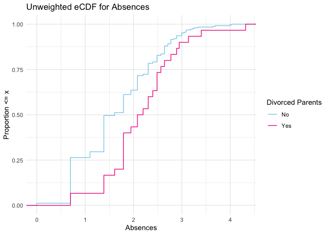
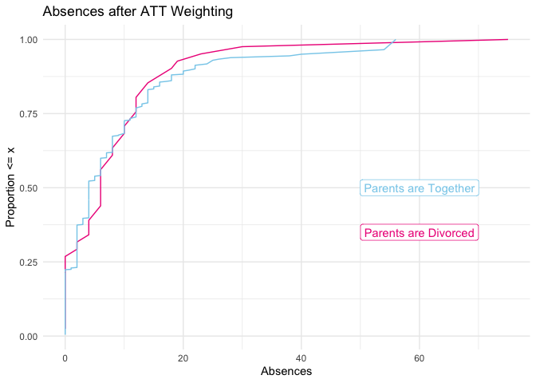
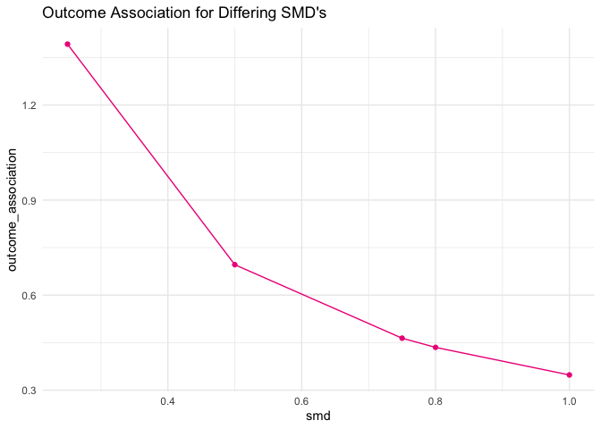

Causal Analysis of Parent Status and Weekend Alcohol Consumption
================
Ellie Grace Moore
4/19/2022

## The Causal Question

We are working with the `student-mat` dataset adapted from Kaggle. The
data were obtained by conducting a survey of 396 students in secondary
math classes. There are 33 variables listed; however we will only be
paying attention to the following:

-   **Pstatus** parent’s cohabitation status (binary: ‘T’ - living
    together or ‘A’ - apart)
-   **Walc** weekend alcohol consumption (numeric: from 1 - very low to
    5 - very high)
-   **sex** student’s sex (binary: ‘F’ - female or ‘M’ - male)
-   **age** student’s age (numeric: from 15 to 22)
-   **internet** Internet access at home (binary: yes or no)
-   **goout** going out with friends (numeric: from 1 - very low to 5 -
    very high)
-   **activities** extra-curricular activities (binary: yes or no)
-   **famrel** quality of family relationships (numeric: from 1 - very
    bad to 5 - excellent)
-   **Mjob** mother’s job (nominal: ‘teacher’, ‘health’ care related,
    civil ‘services’ (e.g. administrative or police), ‘at_home’ or
    ‘other’)
-   **Fjob** father’s job (nominal: ‘teacher’, ‘health’ care related,
    civil ‘services’ (e.g. administrative or police), ‘at_home’ or
    ‘other’)
-   **famsize** family size (binary: ‘LE3’ - less or equal to 3 or
    ‘GT3’ - greater than 3)
-   **absences** number of school absences (numeric: from 0 to 93)
-   **failures** number of past class failures (numeric: n if 1\<=n\<3,
    else 4)
-   **address** student’s home address type (binary: ‘U’ - urban or
    ‘R’ - rural)
-   **freetime** free time after school (numeric: from 1 - very low to
    5 - very high)
-   **Medu** mother’s education (numeric: 0 - none, 1 - primary
    education (4th grade), 2 – 5th to 9th grade, 3 – secondary education
    or 4 – higher education)
-   **Fedu** father’s education (numeric: 0 - none, 1 - primary
    education (4th grade), 2 – 5th to 9th grade, 3 – secondary education
    or 4 – higher education)
-   **Prel** quality of relationship between the parents, unmeasured

## Missing Data

Before we can begin our causal assessment, we must investigate any
missing data. To do this, we create a plot that helps us visualize any
missing data:

``` r
students %>% 
  vis_dat(palette = "cb_safe") +
  ggtitle("Visualizing Missing Data")
```



There are no missing data. Therefore we can continue without any
imputations.

## Proposed DAG

To continue, we specify relationships for our exposure and outcome along
with the other variables. Our proposed DAG is below.

``` r
dag <- dagify(
Walc ~ sex + age + internet + activities + famrel + goout + Mjob + Fjob + famsize + absences + failures + address + freetime,
Pstatus ~ Mjob + Fjob + famsize + famrel + Medu + Fedu + absences + address + Prel, 
  exposure = "Pstatus", 
  outcome = "Walc")
 
dag %>%
  ggdag() + 
  geom_dag_node(color = "deeppink2") + 
  geom_dag_text(color = "black") +
  theme_dag() 
```



To prevent confounders, we need to close the backdoor paths on our DAG.
To do this, we establish the adjustment set and adjust for those
specified variables.

``` r
dag %>%
  ggdag_adjustment_set(stylized = TRUE) +
  geom_dag_text(color = "black") +
  scale_color_manual(values = c("skyblue", "deeppink2")) +
  theme_minimal() +
  ggtitle("Adjustment Set"
  )
```



From the figure above, we can see that we need to adjust for **famrel,
address, famsize, Fjob, Mjob,** and **absences**. These will therefore
be the variables we include in our propensity score model.

## Propensity Score Model

We adjust for the above-listed variables by using a binomial model for
our propensity scores. After specifying our model, we create a mirrored
histogram of the calculated propensity scores for both students with and
without divorced parents.

``` r
students <- 
  glm(Pstatus ~ absences + Mjob + Fjob + famsize + famrel + address,
    data = students,
    family = binomial()) %>%
  augment(type.predict = "response", data = students) 

df_plot_ps <- students %>%
  tidyr::pivot_wider(names_from = Pstatus, 
                     values_from = .fitted,
                     names_prefix = "Pstatus_p")
ggplot(df_plot_ps) +
  geom_histogram(bins = 50, 
                 aes(x = Pstatus_p1), 
                 fill = "deeppink") + 
  geom_histogram(bins = 50, 
                 aes(x = Pstatus_p0, 
                     y = - stat(count)), 
                 fill = "skyblue") + 
  scale_y_continuous("Count", label = abs) + 
  scale_x_continuous("Propensity Score") +
  geom_label(
    label = "Parents are Divorced", 
    x = 0.25,
    y = 6,
  ) + 
  geom_label(
    label = "Parents are Together",
    x = 0.25, 
    y = -15
  ) + 
  theme_minimal()
```



The first observation we can make is that within this dataset, most of
the students have parents that are still together. Also, we notice that
students with parents that are together have a low probability of being
divorced, so the model did a good job here. However, for students with
divorced parents, there is more of a range of probabilities with a
huddle around 0-0.2 range. We will now create a *weighted* mirrored
histogram using weights for the average treatment effect among those
students with divorced parents (ATT).

``` r
students_new <- students %>%
  mutate( 
    w_att = Pstatus + 
      .fitted * (1 - Pstatus) / (1 - .fitted)
  )

df_plot_ps <- students_new %>%
  tidyr::pivot_wider(names_from = Pstatus, 
                     values_from = .fitted,
                     names_prefix = "Pstatus_p")
ggplot(df_plot_ps) +
  geom_histogram(bins = 50, 
                 aes(x = Pstatus_p1), 
                 fill = "deeppink2") + 
  geom_histogram(bins = 50, 
                 alpha = 0.5, 
                 aes(x = Pstatus_p1,  
                     weight = w_att), 
                 fill = "deeppink2") +

  geom_histogram(bins = 50, 
                 aes(x = Pstatus_p0, 
                     y = - stat(count)),
                 fill = "skyblue",
                 alpha = 0.5) + 
  geom_histogram(bins = 50,
                 aes(x = Pstatus_p0, 
                     weight = w_att,
                     y = - stat(count)), 
                 fill = "skyblue") + 
  
  scale_y_continuous("count", label = abs) + 
  scale_x_continuous("propensity score") +
  theme_minimal() + 
  annotate(geom = "label",
           x = 0.3,
           y= 10,
           label = "Parents are Divorced") + 
annotate(geom = "label",
         x = 0.3,
         y = -10,
         label  = "Parents are Together") +
  ggtitle("Weighted Propensity Scores")
```



As expected, the control group (having parents that are together) is
weighted to look more like the treatment group (students with divorced
parents). We will use the same ATT weights throughout the rest of the
analysis.

### Checking the Model

We will now look at scaled mean differences (smds) and empirical CDFs in
order to determine if we need to reiterate our model with any polynomial
or spline terms. We begin by looking at a love plot that shows the smds
for each variable.

``` r
smds <- students_new %>%
  summarize(
    across(c(famsize, famrel, Mjob, Fjob, absences, address),
           list(unweighted = ~smd(.x, Pstatus)$estimate,
                att.weighted = ~smd(.x, Pstatus, w = w_att)$estimate))
  )

plot_df <- smds %>%
  pivot_longer(
    everything(),
    values_to = "SMD",
    names_to = c("Variable", "Method"),
    names_pattern = "(.*)_(.*)"
  ) %>%
  arrange(Method, abs(SMD)) %>%
  mutate(Variable = fct_inorder(Variable))

ggplot(
  data = plot_df,
  aes(x = abs(SMD), y = Variable, 
      group = Method, color = Method)
) +  
  geom_line(orientation = "y") +
  geom_point() + 
  geom_vline(xintercept = 0.1, 
             color = "black", size = 0.1) +
  ggtitle("Love Plot for Fjob, Mjob, Famrel, Famsize, and Absences") + 
  scale_color_manual(values = c("deeppink2", "skyblue")) + 
  theme_minimal()
```



It is to be expected that our unweighted model does not fall within the
smd bound of being less than 0.1. However, the key thing to notice here
is that our model with the ATT weights have smds that are all less than
0.1. Next we look at an unweighted eCDF for absences (since absences is
the only roughly continuous variable)

``` r
ggplot(students_new, 
       aes(x = log(absences), group = Pstatus, 
           color = factor(Pstatus))) +
  stat_ecdf() +
  scale_color_manual("Divorced Parents", 
                     values = c("skyblue", "deeppink2"),
                     labels = c("No", "Yes")) + 
  scale_x_continuous("Absences") + 
  ylab("Proportion <= x") + 
  ggtitle("Unweighted eCDF for Absences") +
  theme_minimal()
```



This eCDF is not bad, however the distributions could line up better in
the middle. Let us now create a weighted eCDF (again, with our ATT
weights) to see if we can get these distributions to line up better.

``` r
ecdf_1 <- students_new %>%
  filter(Pstatus == 1) %>%
  arrange(absences) %>%
  mutate(cum_pct = cumsum(w_att) / sum(w_att))

ecdf_0 <- students_new %>%
  filter(Pstatus == 0) %>%
  arrange(absences) %>%
  mutate(cum_pct = cumsum(w_att) / sum(w_att))

ggplot(ecdf_1, aes(x = absences, y = cum_pct)) +
  geom_line(color = "deeppink2") +
  geom_line(data = ecdf_0, 
            aes(x = absences, y = cum_pct), 
            color = "skyblue") + 
  xlab("Absences") + 
  ylab("Proportion <= x") + 
  ggtitle("Absences after ATT Weighting") +
annotate(geom = "label",
         x = 60,
         y = 0.5,
         color = "skyblue",
         label = "Parents are Together") +
annotate(geom = "label",
         x = 60,
         y = 0.35,
         color = "deeppink2",
         label = "Parents are Divorced") +
  theme_minimal()
```



This weighted eCDF looks a little better. After looking at the love plot
and weighted eCDF, we can conclude that we do not need to iterate our
propensity score model.

### The Effect

``` r
ATT <- students_new %>% 
  summarise((sum(Pstatus*Walc*w_att)/sum(Pstatus*w_att))-(sum((1-Pstatus)*Walc*w_att)/sum((1-Pstatus)*w_att))); ATT
```

    ## # A tibble: 1 × 1
    ##   `(sum(Pstatus * Walc * w_att) / sum(Pstatus * w_att)) - ...`
    ##                                                          <dbl>
    ## 1                                                       -0.123

We are able to see that our causal effect is -0.12. In context–and
recalling that this is the average treatment effect among the treated
and that `Walc` is a scale from 0 to 5–if these students with divorced
parents had parents that were still together, then they would drink a
factor of .12 less alcohol on the weekends.

#### Uncertainty Estimates

``` r
set.seed(1)
bootstrap <- bootstraps(students_new, 1000, apparent = TRUE) %>%
  mutate(df = map(splits, analysis))

fit_ipw <- function(split, ...) {
  .df <- analysis(split)
  # fit propensity score model
  propensity_model <- glm(
    Pstatus ~ absences + Mjob + Fjob + famsize + famrel + address,
    family = binomial(), 
    data = .df
  )
  # calculate inverse probability weights
  .df <- propensity_model %>% 
    augment(type.predict = "response", data = .df) %>% 
    mutate(wts = Pstatus  + .fitted * (1 - Pstatus) / (1  - .fitted)) 
  # fit correctly bootsrapped ipw model
  lm(Walc ~ Pstatus, data = .df, weights = wts) %>% 
    tidy()
}

estimate <- array()
std_error <- array()
for (i in 1:1000) {
    estimate[i] = fit_ipw(bootstrap$splits[[i]])[2,] %>% pull("estimate")
    std_error[i] = fit_ipw(bootstrap$splits[[i]])[2,] %>% pull("std.error")
}

estimates <- data.frame(estimate, std_error)
x <- quantile(estimates$estimate, probs = c(0.025, 0.975))
y <- quantile(estimates$std_error, probs = c(0.025, 0.975))
```

From the code above, we are able to calculate a 95% bootstrapped
confidence interval for the ATT estimate, which is (-0.54, 0.35) with
standard error (.12, .15). Here we can note that since 0 is included in
this 95% CI for our ATT estimate, that **there may not be sufficient
evidence to conclude that there is a true causal effect between divorced
parents and a students weekend alcohol consumption.**

### Sensitivity Analysis

Since we had the unmeasured variable of `Prel`, we will conduct a
sensitivity analysis to see the association outcome needed for `Prel` in
order to nullify our causal effect. Since this variable is unmeasured,
we choose a varying set of standardized mean differences, then we see
the outcome association for each of these values. Note that we use the
upper end of our confidence interval since that one will be closer to
zero.

``` r
smd <- c(.25, .5, .75, .8, 1)
tip_lm(effect = 0.348,
        smd = smd) %>%
  ggplot(aes(x = smd, y = outcome_association)) + 
  geom_line(col = "deeppink2") +
  geom_point(col = "deeppink2") + 
  theme_minimal() + 
  ggtitle("Outcome Association for Differing SMD's")
```



So for example, if `Prel` had an smd of 0.5, then the relationship
between Prel and Walc would have to be approximately 0.7 in order to
nullify our causal estimate.
