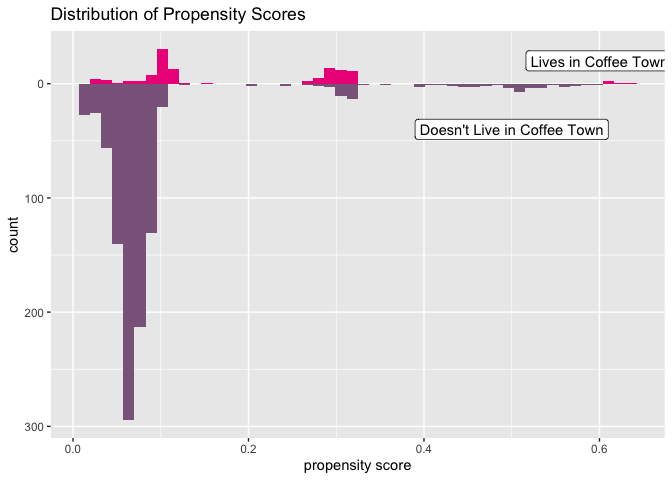
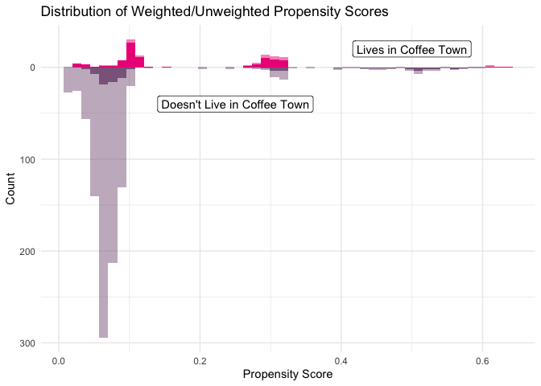
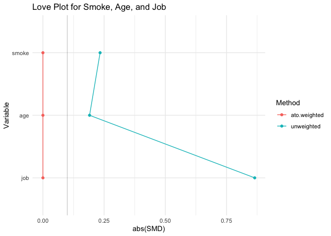
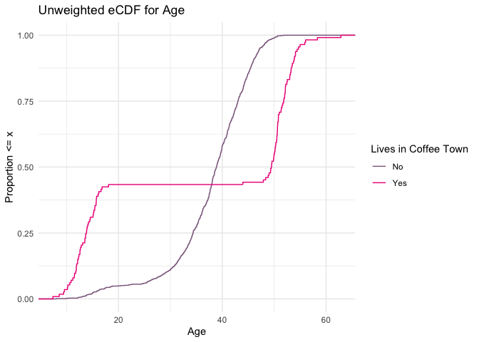
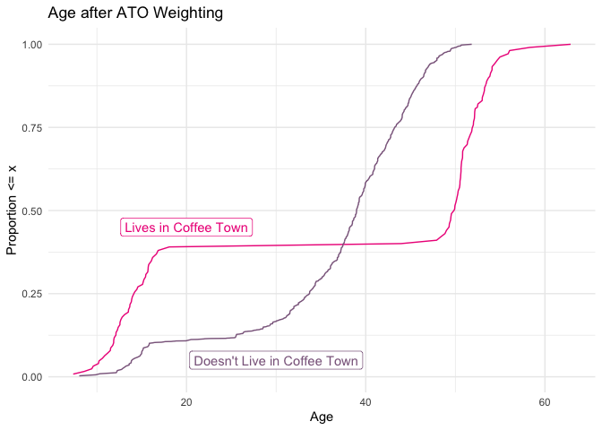
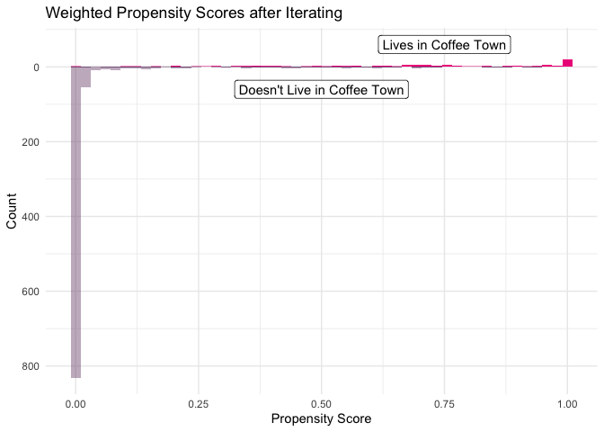
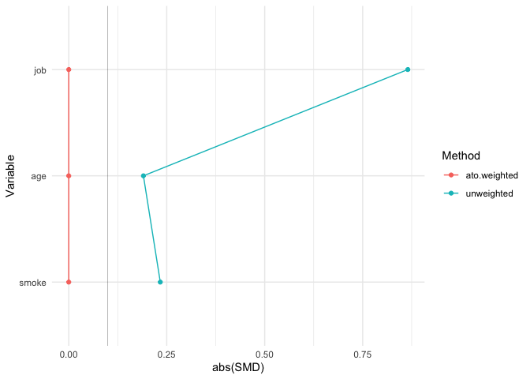
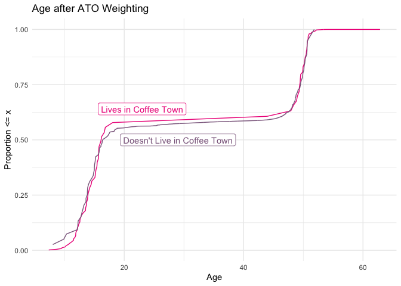

Lab 03 - Using Propensity Scores
================
Lucy D’Agostino McGowan
2022-03-29

``` r
library(tidyverse)
library(smd)
library(cli)
library(gtsummary)
library(ggdag)
library(survey)
library(dagitty)
library(broom)
```

## Exercise 1

``` r
coffee <- read.csv("coffee_town_df.csv")

coffee %>% count(coffee_town)
```

    ##   coffee_town   n
    ## 1           0 987
    ## 2           1 113

For this data set we have 1100 observations with coffee\_town as our
exposure. There are 987 in the unexposed group (those who do not live in
coffee town) and 113 in the exposed group (those who do live in coffee
town). The outcome is the cups\_of\_coffee and the other variables are
job, smoke, and age. Job is categorical and ranks the jobs level of
difficulty as either easy, hard, or none. Smoke is also a categorical
variable with categories never, former, or current. There is no missing
data.

## Exercise 2

``` r
coffee %>%
  tbl_summary(
    by = coffee_town, 
    include = c( #Vector of adjustment variables
                "cups_of_coffee",
                "age",
                "job",
                "smoke")) %>%
  add_overall()
```

<div id="gbbepudgah" style="overflow-x:auto;overflow-y:auto;width:auto;height:auto;">
<style>html {
  font-family: -apple-system, BlinkMacSystemFont, 'Segoe UI', Roboto, Oxygen, Ubuntu, Cantarell, 'Helvetica Neue', 'Fira Sans', 'Droid Sans', Arial, sans-serif;
}

#gbbepudgah .gt_table {
  display: table;
  border-collapse: collapse;
  margin-left: auto;
  margin-right: auto;
  color: #333333;
  font-size: 16px;
  font-weight: normal;
  font-style: normal;
  background-color: #FFFFFF;
  width: auto;
  border-top-style: solid;
  border-top-width: 2px;
  border-top-color: #A8A8A8;
  border-right-style: none;
  border-right-width: 2px;
  border-right-color: #D3D3D3;
  border-bottom-style: solid;
  border-bottom-width: 2px;
  border-bottom-color: #A8A8A8;
  border-left-style: none;
  border-left-width: 2px;
  border-left-color: #D3D3D3;
}

#gbbepudgah .gt_heading {
  background-color: #FFFFFF;
  text-align: center;
  border-bottom-color: #FFFFFF;
  border-left-style: none;
  border-left-width: 1px;
  border-left-color: #D3D3D3;
  border-right-style: none;
  border-right-width: 1px;
  border-right-color: #D3D3D3;
}

#gbbepudgah .gt_title {
  color: #333333;
  font-size: 125%;
  font-weight: initial;
  padding-top: 4px;
  padding-bottom: 4px;
  padding-left: 5px;
  padding-right: 5px;
  border-bottom-color: #FFFFFF;
  border-bottom-width: 0;
}

#gbbepudgah .gt_subtitle {
  color: #333333;
  font-size: 85%;
  font-weight: initial;
  padding-top: 0;
  padding-bottom: 6px;
  padding-left: 5px;
  padding-right: 5px;
  border-top-color: #FFFFFF;
  border-top-width: 0;
}

#gbbepudgah .gt_bottom_border {
  border-bottom-style: solid;
  border-bottom-width: 2px;
  border-bottom-color: #D3D3D3;
}

#gbbepudgah .gt_col_headings {
  border-top-style: solid;
  border-top-width: 2px;
  border-top-color: #D3D3D3;
  border-bottom-style: solid;
  border-bottom-width: 2px;
  border-bottom-color: #D3D3D3;
  border-left-style: none;
  border-left-width: 1px;
  border-left-color: #D3D3D3;
  border-right-style: none;
  border-right-width: 1px;
  border-right-color: #D3D3D3;
}

#gbbepudgah .gt_col_heading {
  color: #333333;
  background-color: #FFFFFF;
  font-size: 100%;
  font-weight: normal;
  text-transform: inherit;
  border-left-style: none;
  border-left-width: 1px;
  border-left-color: #D3D3D3;
  border-right-style: none;
  border-right-width: 1px;
  border-right-color: #D3D3D3;
  vertical-align: bottom;
  padding-top: 5px;
  padding-bottom: 6px;
  padding-left: 5px;
  padding-right: 5px;
  overflow-x: hidden;
}

#gbbepudgah .gt_column_spanner_outer {
  color: #333333;
  background-color: #FFFFFF;
  font-size: 100%;
  font-weight: normal;
  text-transform: inherit;
  padding-top: 0;
  padding-bottom: 0;
  padding-left: 4px;
  padding-right: 4px;
}

#gbbepudgah .gt_column_spanner_outer:first-child {
  padding-left: 0;
}

#gbbepudgah .gt_column_spanner_outer:last-child {
  padding-right: 0;
}

#gbbepudgah .gt_column_spanner {
  border-bottom-style: solid;
  border-bottom-width: 2px;
  border-bottom-color: #D3D3D3;
  vertical-align: bottom;
  padding-top: 5px;
  padding-bottom: 5px;
  overflow-x: hidden;
  display: inline-block;
  width: 100%;
}

#gbbepudgah .gt_group_heading {
  padding-top: 8px;
  padding-bottom: 8px;
  padding-left: 5px;
  padding-right: 5px;
  color: #333333;
  background-color: #FFFFFF;
  font-size: 100%;
  font-weight: initial;
  text-transform: inherit;
  border-top-style: solid;
  border-top-width: 2px;
  border-top-color: #D3D3D3;
  border-bottom-style: solid;
  border-bottom-width: 2px;
  border-bottom-color: #D3D3D3;
  border-left-style: none;
  border-left-width: 1px;
  border-left-color: #D3D3D3;
  border-right-style: none;
  border-right-width: 1px;
  border-right-color: #D3D3D3;
  vertical-align: middle;
}

#gbbepudgah .gt_empty_group_heading {
  padding: 0.5px;
  color: #333333;
  background-color: #FFFFFF;
  font-size: 100%;
  font-weight: initial;
  border-top-style: solid;
  border-top-width: 2px;
  border-top-color: #D3D3D3;
  border-bottom-style: solid;
  border-bottom-width: 2px;
  border-bottom-color: #D3D3D3;
  vertical-align: middle;
}

#gbbepudgah .gt_from_md > :first-child {
  margin-top: 0;
}

#gbbepudgah .gt_from_md > :last-child {
  margin-bottom: 0;
}

#gbbepudgah .gt_row {
  padding-top: 8px;
  padding-bottom: 8px;
  padding-left: 5px;
  padding-right: 5px;
  margin: 10px;
  border-top-style: solid;
  border-top-width: 1px;
  border-top-color: #D3D3D3;
  border-left-style: none;
  border-left-width: 1px;
  border-left-color: #D3D3D3;
  border-right-style: none;
  border-right-width: 1px;
  border-right-color: #D3D3D3;
  vertical-align: middle;
  overflow-x: hidden;
}

#gbbepudgah .gt_stub {
  color: #333333;
  background-color: #FFFFFF;
  font-size: 100%;
  font-weight: initial;
  text-transform: inherit;
  border-right-style: solid;
  border-right-width: 2px;
  border-right-color: #D3D3D3;
  padding-left: 5px;
  padding-right: 5px;
}

#gbbepudgah .gt_stub_row_group {
  color: #333333;
  background-color: #FFFFFF;
  font-size: 100%;
  font-weight: initial;
  text-transform: inherit;
  border-right-style: solid;
  border-right-width: 2px;
  border-right-color: #D3D3D3;
  padding-left: 5px;
  padding-right: 5px;
  vertical-align: top;
}

#gbbepudgah .gt_row_group_first td {
  border-top-width: 2px;
}

#gbbepudgah .gt_summary_row {
  color: #333333;
  background-color: #FFFFFF;
  text-transform: inherit;
  padding-top: 8px;
  padding-bottom: 8px;
  padding-left: 5px;
  padding-right: 5px;
}

#gbbepudgah .gt_first_summary_row {
  border-top-style: solid;
  border-top-color: #D3D3D3;
}

#gbbepudgah .gt_first_summary_row.thick {
  border-top-width: 2px;
}

#gbbepudgah .gt_last_summary_row {
  padding-top: 8px;
  padding-bottom: 8px;
  padding-left: 5px;
  padding-right: 5px;
  border-bottom-style: solid;
  border-bottom-width: 2px;
  border-bottom-color: #D3D3D3;
}

#gbbepudgah .gt_grand_summary_row {
  color: #333333;
  background-color: #FFFFFF;
  text-transform: inherit;
  padding-top: 8px;
  padding-bottom: 8px;
  padding-left: 5px;
  padding-right: 5px;
}

#gbbepudgah .gt_first_grand_summary_row {
  padding-top: 8px;
  padding-bottom: 8px;
  padding-left: 5px;
  padding-right: 5px;
  border-top-style: double;
  border-top-width: 6px;
  border-top-color: #D3D3D3;
}

#gbbepudgah .gt_striped {
  background-color: rgba(128, 128, 128, 0.05);
}

#gbbepudgah .gt_table_body {
  border-top-style: solid;
  border-top-width: 2px;
  border-top-color: #D3D3D3;
  border-bottom-style: solid;
  border-bottom-width: 2px;
  border-bottom-color: #D3D3D3;
}

#gbbepudgah .gt_footnotes {
  color: #333333;
  background-color: #FFFFFF;
  border-bottom-style: none;
  border-bottom-width: 2px;
  border-bottom-color: #D3D3D3;
  border-left-style: none;
  border-left-width: 2px;
  border-left-color: #D3D3D3;
  border-right-style: none;
  border-right-width: 2px;
  border-right-color: #D3D3D3;
}

#gbbepudgah .gt_footnote {
  margin: 0px;
  font-size: 90%;
  padding-left: 4px;
  padding-right: 4px;
  padding-left: 5px;
  padding-right: 5px;
}

#gbbepudgah .gt_sourcenotes {
  color: #333333;
  background-color: #FFFFFF;
  border-bottom-style: none;
  border-bottom-width: 2px;
  border-bottom-color: #D3D3D3;
  border-left-style: none;
  border-left-width: 2px;
  border-left-color: #D3D3D3;
  border-right-style: none;
  border-right-width: 2px;
  border-right-color: #D3D3D3;
}

#gbbepudgah .gt_sourcenote {
  font-size: 90%;
  padding-top: 4px;
  padding-bottom: 4px;
  padding-left: 5px;
  padding-right: 5px;
}

#gbbepudgah .gt_left {
  text-align: left;
}

#gbbepudgah .gt_center {
  text-align: center;
}

#gbbepudgah .gt_right {
  text-align: right;
  font-variant-numeric: tabular-nums;
}

#gbbepudgah .gt_font_normal {
  font-weight: normal;
}

#gbbepudgah .gt_font_bold {
  font-weight: bold;
}

#gbbepudgah .gt_font_italic {
  font-style: italic;
}

#gbbepudgah .gt_super {
  font-size: 65%;
}

#gbbepudgah .gt_footnote_marks {
  font-style: italic;
  font-weight: normal;
  font-size: 75%;
  vertical-align: 0.4em;
}

#gbbepudgah .gt_asterisk {
  font-size: 100%;
  vertical-align: 0;
}

#gbbepudgah .gt_slash_mark {
  font-size: 0.7em;
  line-height: 0.7em;
  vertical-align: 0.15em;
}

#gbbepudgah .gt_fraction_numerator {
  font-size: 0.6em;
  line-height: 0.6em;
  vertical-align: 0.45em;
}

#gbbepudgah .gt_fraction_denominator {
  font-size: 0.6em;
  line-height: 0.6em;
  vertical-align: -0.05em;
}
</style>
<table class="gt_table">
  
  <thead class="gt_col_headings">
    <tr>
      <th class="gt_col_heading gt_columns_bottom_border gt_left" rowspan="1" colspan="1"><strong>Characteristic</strong></th>
      <th class="gt_col_heading gt_columns_bottom_border gt_center" rowspan="1" colspan="1"><strong>Overall</strong>, N = 1,100<sup class="gt_footnote_marks">1</sup></th>
      <th class="gt_col_heading gt_columns_bottom_border gt_center" rowspan="1" colspan="1"><strong>0</strong>, N = 987<sup class="gt_footnote_marks">1</sup></th>
      <th class="gt_col_heading gt_columns_bottom_border gt_center" rowspan="1" colspan="1"><strong>1</strong>, N = 113<sup class="gt_footnote_marks">1</sup></th>
    </tr>
  </thead>
  <tbody class="gt_table_body">
    <tr><td class="gt_row gt_left">cups_of_coffee</td>
<td class="gt_row gt_center"></td>
<td class="gt_row gt_center"></td>
<td class="gt_row gt_center"></td></tr>
    <tr><td class="gt_row gt_left" style="text-align: left; text-indent: 10px;">0</td>
<td class="gt_row gt_center">92 (8.4%)</td>
<td class="gt_row gt_center">43 (4.4%)</td>
<td class="gt_row gt_center">49 (43%)</td></tr>
    <tr><td class="gt_row gt_left" style="text-align: left; text-indent: 10px;">1</td>
<td class="gt_row gt_center">104 (9.5%)</td>
<td class="gt_row gt_center">104 (11%)</td>
<td class="gt_row gt_center">0 (0%)</td></tr>
    <tr><td class="gt_row gt_left" style="text-align: left; text-indent: 10px;">2</td>
<td class="gt_row gt_center">461 (42%)</td>
<td class="gt_row gt_center">461 (47%)</td>
<td class="gt_row gt_center">0 (0%)</td></tr>
    <tr><td class="gt_row gt_left" style="text-align: left; text-indent: 10px;">3</td>
<td class="gt_row gt_center">352 (32%)</td>
<td class="gt_row gt_center">350 (35%)</td>
<td class="gt_row gt_center">2 (1.8%)</td></tr>
    <tr><td class="gt_row gt_left" style="text-align: left; text-indent: 10px;">4</td>
<td class="gt_row gt_center">86 (7.8%)</td>
<td class="gt_row gt_center">29 (2.9%)</td>
<td class="gt_row gt_center">57 (50%)</td></tr>
    <tr><td class="gt_row gt_left" style="text-align: left; text-indent: 10px;">5</td>
<td class="gt_row gt_center">4 (0.4%)</td>
<td class="gt_row gt_center">0 (0%)</td>
<td class="gt_row gt_center">4 (3.5%)</td></tr>
    <tr><td class="gt_row gt_left" style="text-align: left; text-indent: 10px;">6</td>
<td class="gt_row gt_center">1 (&lt;0.1%)</td>
<td class="gt_row gt_center">0 (0%)</td>
<td class="gt_row gt_center">1 (0.9%)</td></tr>
    <tr><td class="gt_row gt_left">age</td>
<td class="gt_row gt_center">39 (34, 44)</td>
<td class="gt_row gt_center">39 (34, 43)</td>
<td class="gt_row gt_center">49 (14, 52)</td></tr>
    <tr><td class="gt_row gt_left">job</td>
<td class="gt_row gt_center"></td>
<td class="gt_row gt_center"></td>
<td class="gt_row gt_center"></td></tr>
    <tr><td class="gt_row gt_left" style="text-align: left; text-indent: 10px;">easy</td>
<td class="gt_row gt_center">760 (69%)</td>
<td class="gt_row gt_center">707 (72%)</td>
<td class="gt_row gt_center">53 (47%)</td></tr>
    <tr><td class="gt_row gt_left" style="text-align: left; text-indent: 10px;">hard</td>
<td class="gt_row gt_center">212 (19%)</td>
<td class="gt_row gt_center">200 (20%)</td>
<td class="gt_row gt_center">12 (11%)</td></tr>
    <tr><td class="gt_row gt_left" style="text-align: left; text-indent: 10px;">none</td>
<td class="gt_row gt_center">128 (12%)</td>
<td class="gt_row gt_center">80 (8.1%)</td>
<td class="gt_row gt_center">48 (42%)</td></tr>
    <tr><td class="gt_row gt_left">smoke</td>
<td class="gt_row gt_center"></td>
<td class="gt_row gt_center"></td>
<td class="gt_row gt_center"></td></tr>
    <tr><td class="gt_row gt_left" style="text-align: left; text-indent: 10px;">current</td>
<td class="gt_row gt_center">55 (5.0%)</td>
<td class="gt_row gt_center">53 (5.4%)</td>
<td class="gt_row gt_center">2 (1.8%)</td></tr>
    <tr><td class="gt_row gt_left" style="text-align: left; text-indent: 10px;">former</td>
<td class="gt_row gt_center">64 (5.8%)</td>
<td class="gt_row gt_center">60 (6.1%)</td>
<td class="gt_row gt_center">4 (3.5%)</td></tr>
    <tr><td class="gt_row gt_left" style="text-align: left; text-indent: 10px;">never</td>
<td class="gt_row gt_center">981 (89%)</td>
<td class="gt_row gt_center">874 (89%)</td>
<td class="gt_row gt_center">107 (95%)</td></tr>
  </tbody>
  
  <tfoot class="gt_footnotes">
    <tr>
      <td class="gt_footnote" colspan="4"><sup class="gt_footnote_marks">1</sup> n (%); Median (IQR)</td>
    </tr>
  </tfoot>
</table>
</div>

From this table, we are able to get a better idea of how the data is
distributed. For example, it is more common for those who do not live in
coffee town to drink 1-3 cups of coffee than those who do live in coffee
town. We can also notice that 0% of people who do not live in coffee
town drink 5-6 cups of coffee whereas 3.5% and .9% of people who live in
coffee town drink 5 and 6 cups of coffee. We can also notice that coffee
town has a higher median age and it looks like the ages have a higher
range (although skewed on the older side) than the ages of those who do
not live in coffee town. Looking at the job section, we can see that
coffee town has a higher unemployment rate whereas those who do not live
in coffee town tend to have easier jobs. Lastly, the smoking categories
between the exposure groups appear to be relatively similar. Majority of
people in both places have never smoked, although there are more current
smokers not living in coffee town.

## Exercise 3

``` r
coffee <- 
  glm(coffee_town ~ age + smoke + job,
    data = coffee,
    family = binomial()) %>%
  augment(type.predict = "response", data = coffee) 

df_plot_ps <- coffee %>%
  tidyr::pivot_wider(names_from = coffee_town, 
                     values_from = .fitted, 
                     names_prefix = "coffee_town_p")

ggplot(df_plot_ps) +
  geom_histogram(bins = 50, 
                 aes(x = coffee_town_p1), 
                 fill = "deeppink2") + 
  geom_histogram(bins = 50, 
                 aes(x = coffee_town_p0, 
                     y = - stat(count)), 
                 fill = "plum4") + 
  
  scale_y_continuous("count", label = abs) + 
  scale_x_continuous("propensity score") +
  annotate(geom = "label",
           x = 0.6,
           y= 20,
           label = "Lives in Coffee Town") + 
annotate(geom = "label",
         x = 0.5,
         y = -40,
         label  = "Doesn't Live in Coffee Town") +
  ggtitle("Distribution of Propensity Scores")
```

    ## Warning: Removed 987 rows containing non-finite values (stat_bin).

    ## Warning: Removed 113 rows containing non-finite values (stat_bin).

<!-- -->

``` r
  theme_minimal()
```

    ## List of 93
    ##  $ line                      :List of 6
    ##   ..$ colour       : chr "black"
    ##   ..$ size         : num 0.5
    ##   ..$ linetype     : num 1
    ##   ..$ lineend      : chr "butt"
    ##   ..$ arrow        : logi FALSE
    ##   ..$ inherit.blank: logi TRUE
    ##   ..- attr(*, "class")= chr [1:2] "element_line" "element"
    ##  $ rect                      :List of 5
    ##   ..$ fill         : chr "white"
    ##   ..$ colour       : chr "black"
    ##   ..$ size         : num 0.5
    ##   ..$ linetype     : num 1
    ##   ..$ inherit.blank: logi TRUE
    ##   ..- attr(*, "class")= chr [1:2] "element_rect" "element"
    ##  $ text                      :List of 11
    ##   ..$ family       : chr ""
    ##   ..$ face         : chr "plain"
    ##   ..$ colour       : chr "black"
    ##   ..$ size         : num 11
    ##   ..$ hjust        : num 0.5
    ##   ..$ vjust        : num 0.5
    ##   ..$ angle        : num 0
    ##   ..$ lineheight   : num 0.9
    ##   ..$ margin       : 'margin' num [1:4] 0pt 0pt 0pt 0pt
    ##   .. ..- attr(*, "valid.unit")= int 8
    ##   .. ..- attr(*, "unit")= chr "pt"
    ##   ..$ debug        : logi FALSE
    ##   ..$ inherit.blank: logi TRUE
    ##   ..- attr(*, "class")= chr [1:2] "element_text" "element"
    ##  $ title                     : NULL
    ##  $ aspect.ratio              : NULL
    ##  $ axis.title                : NULL
    ##  $ axis.title.x              :List of 11
    ##   ..$ family       : NULL
    ##   ..$ face         : NULL
    ##   ..$ colour       : NULL
    ##   ..$ size         : NULL
    ##   ..$ hjust        : NULL
    ##   ..$ vjust        : num 1
    ##   ..$ angle        : NULL
    ##   ..$ lineheight   : NULL
    ##   ..$ margin       : 'margin' num [1:4] 2.75pt 0pt 0pt 0pt
    ##   .. ..- attr(*, "valid.unit")= int 8
    ##   .. ..- attr(*, "unit")= chr "pt"
    ##   ..$ debug        : NULL
    ##   ..$ inherit.blank: logi TRUE
    ##   ..- attr(*, "class")= chr [1:2] "element_text" "element"
    ##  $ axis.title.x.top          :List of 11
    ##   ..$ family       : NULL
    ##   ..$ face         : NULL
    ##   ..$ colour       : NULL
    ##   ..$ size         : NULL
    ##   ..$ hjust        : NULL
    ##   ..$ vjust        : num 0
    ##   ..$ angle        : NULL
    ##   ..$ lineheight   : NULL
    ##   ..$ margin       : 'margin' num [1:4] 0pt 0pt 2.75pt 0pt
    ##   .. ..- attr(*, "valid.unit")= int 8
    ##   .. ..- attr(*, "unit")= chr "pt"
    ##   ..$ debug        : NULL
    ##   ..$ inherit.blank: logi TRUE
    ##   ..- attr(*, "class")= chr [1:2] "element_text" "element"
    ##  $ axis.title.x.bottom       : NULL
    ##  $ axis.title.y              :List of 11
    ##   ..$ family       : NULL
    ##   ..$ face         : NULL
    ##   ..$ colour       : NULL
    ##   ..$ size         : NULL
    ##   ..$ hjust        : NULL
    ##   ..$ vjust        : num 1
    ##   ..$ angle        : num 90
    ##   ..$ lineheight   : NULL
    ##   ..$ margin       : 'margin' num [1:4] 0pt 2.75pt 0pt 0pt
    ##   .. ..- attr(*, "valid.unit")= int 8
    ##   .. ..- attr(*, "unit")= chr "pt"
    ##   ..$ debug        : NULL
    ##   ..$ inherit.blank: logi TRUE
    ##   ..- attr(*, "class")= chr [1:2] "element_text" "element"
    ##  $ axis.title.y.left         : NULL
    ##  $ axis.title.y.right        :List of 11
    ##   ..$ family       : NULL
    ##   ..$ face         : NULL
    ##   ..$ colour       : NULL
    ##   ..$ size         : NULL
    ##   ..$ hjust        : NULL
    ##   ..$ vjust        : num 0
    ##   ..$ angle        : num -90
    ##   ..$ lineheight   : NULL
    ##   ..$ margin       : 'margin' num [1:4] 0pt 0pt 0pt 2.75pt
    ##   .. ..- attr(*, "valid.unit")= int 8
    ##   .. ..- attr(*, "unit")= chr "pt"
    ##   ..$ debug        : NULL
    ##   ..$ inherit.blank: logi TRUE
    ##   ..- attr(*, "class")= chr [1:2] "element_text" "element"
    ##  $ axis.text                 :List of 11
    ##   ..$ family       : NULL
    ##   ..$ face         : NULL
    ##   ..$ colour       : chr "grey30"
    ##   ..$ size         : 'rel' num 0.8
    ##   ..$ hjust        : NULL
    ##   ..$ vjust        : NULL
    ##   ..$ angle        : NULL
    ##   ..$ lineheight   : NULL
    ##   ..$ margin       : NULL
    ##   ..$ debug        : NULL
    ##   ..$ inherit.blank: logi TRUE
    ##   ..- attr(*, "class")= chr [1:2] "element_text" "element"
    ##  $ axis.text.x               :List of 11
    ##   ..$ family       : NULL
    ##   ..$ face         : NULL
    ##   ..$ colour       : NULL
    ##   ..$ size         : NULL
    ##   ..$ hjust        : NULL
    ##   ..$ vjust        : num 1
    ##   ..$ angle        : NULL
    ##   ..$ lineheight   : NULL
    ##   ..$ margin       : 'margin' num [1:4] 2.2pt 0pt 0pt 0pt
    ##   .. ..- attr(*, "valid.unit")= int 8
    ##   .. ..- attr(*, "unit")= chr "pt"
    ##   ..$ debug        : NULL
    ##   ..$ inherit.blank: logi TRUE
    ##   ..- attr(*, "class")= chr [1:2] "element_text" "element"
    ##  $ axis.text.x.top           :List of 11
    ##   ..$ family       : NULL
    ##   ..$ face         : NULL
    ##   ..$ colour       : NULL
    ##   ..$ size         : NULL
    ##   ..$ hjust        : NULL
    ##   ..$ vjust        : num 0
    ##   ..$ angle        : NULL
    ##   ..$ lineheight   : NULL
    ##   ..$ margin       : 'margin' num [1:4] 0pt 0pt 2.2pt 0pt
    ##   .. ..- attr(*, "valid.unit")= int 8
    ##   .. ..- attr(*, "unit")= chr "pt"
    ##   ..$ debug        : NULL
    ##   ..$ inherit.blank: logi TRUE
    ##   ..- attr(*, "class")= chr [1:2] "element_text" "element"
    ##  $ axis.text.x.bottom        : NULL
    ##  $ axis.text.y               :List of 11
    ##   ..$ family       : NULL
    ##   ..$ face         : NULL
    ##   ..$ colour       : NULL
    ##   ..$ size         : NULL
    ##   ..$ hjust        : num 1
    ##   ..$ vjust        : NULL
    ##   ..$ angle        : NULL
    ##   ..$ lineheight   : NULL
    ##   ..$ margin       : 'margin' num [1:4] 0pt 2.2pt 0pt 0pt
    ##   .. ..- attr(*, "valid.unit")= int 8
    ##   .. ..- attr(*, "unit")= chr "pt"
    ##   ..$ debug        : NULL
    ##   ..$ inherit.blank: logi TRUE
    ##   ..- attr(*, "class")= chr [1:2] "element_text" "element"
    ##  $ axis.text.y.left          : NULL
    ##  $ axis.text.y.right         :List of 11
    ##   ..$ family       : NULL
    ##   ..$ face         : NULL
    ##   ..$ colour       : NULL
    ##   ..$ size         : NULL
    ##   ..$ hjust        : num 0
    ##   ..$ vjust        : NULL
    ##   ..$ angle        : NULL
    ##   ..$ lineheight   : NULL
    ##   ..$ margin       : 'margin' num [1:4] 0pt 0pt 0pt 2.2pt
    ##   .. ..- attr(*, "valid.unit")= int 8
    ##   .. ..- attr(*, "unit")= chr "pt"
    ##   ..$ debug        : NULL
    ##   ..$ inherit.blank: logi TRUE
    ##   ..- attr(*, "class")= chr [1:2] "element_text" "element"
    ##  $ axis.ticks                : list()
    ##   ..- attr(*, "class")= chr [1:2] "element_blank" "element"
    ##  $ axis.ticks.x              : NULL
    ##  $ axis.ticks.x.top          : NULL
    ##  $ axis.ticks.x.bottom       : NULL
    ##  $ axis.ticks.y              : NULL
    ##  $ axis.ticks.y.left         : NULL
    ##  $ axis.ticks.y.right        : NULL
    ##  $ axis.ticks.length         : 'unit' num 2.75pt
    ##   ..- attr(*, "valid.unit")= int 8
    ##   ..- attr(*, "unit")= chr "pt"
    ##  $ axis.ticks.length.x       : NULL
    ##  $ axis.ticks.length.x.top   : NULL
    ##  $ axis.ticks.length.x.bottom: NULL
    ##  $ axis.ticks.length.y       : NULL
    ##  $ axis.ticks.length.y.left  : NULL
    ##  $ axis.ticks.length.y.right : NULL
    ##  $ axis.line                 : list()
    ##   ..- attr(*, "class")= chr [1:2] "element_blank" "element"
    ##  $ axis.line.x               : NULL
    ##  $ axis.line.x.top           : NULL
    ##  $ axis.line.x.bottom        : NULL
    ##  $ axis.line.y               : NULL
    ##  $ axis.line.y.left          : NULL
    ##  $ axis.line.y.right         : NULL
    ##  $ legend.background         : list()
    ##   ..- attr(*, "class")= chr [1:2] "element_blank" "element"
    ##  $ legend.margin             : 'margin' num [1:4] 5.5pt 5.5pt 5.5pt 5.5pt
    ##   ..- attr(*, "valid.unit")= int 8
    ##   ..- attr(*, "unit")= chr "pt"
    ##  $ legend.spacing            : 'unit' num 11pt
    ##   ..- attr(*, "valid.unit")= int 8
    ##   ..- attr(*, "unit")= chr "pt"
    ##  $ legend.spacing.x          : NULL
    ##  $ legend.spacing.y          : NULL
    ##  $ legend.key                : list()
    ##   ..- attr(*, "class")= chr [1:2] "element_blank" "element"
    ##  $ legend.key.size           : 'unit' num 1.2lines
    ##   ..- attr(*, "valid.unit")= int 3
    ##   ..- attr(*, "unit")= chr "lines"
    ##  $ legend.key.height         : NULL
    ##  $ legend.key.width          : NULL
    ##  $ legend.text               :List of 11
    ##   ..$ family       : NULL
    ##   ..$ face         : NULL
    ##   ..$ colour       : NULL
    ##   ..$ size         : 'rel' num 0.8
    ##   ..$ hjust        : NULL
    ##   ..$ vjust        : NULL
    ##   ..$ angle        : NULL
    ##   ..$ lineheight   : NULL
    ##   ..$ margin       : NULL
    ##   ..$ debug        : NULL
    ##   ..$ inherit.blank: logi TRUE
    ##   ..- attr(*, "class")= chr [1:2] "element_text" "element"
    ##  $ legend.text.align         : NULL
    ##  $ legend.title              :List of 11
    ##   ..$ family       : NULL
    ##   ..$ face         : NULL
    ##   ..$ colour       : NULL
    ##   ..$ size         : NULL
    ##   ..$ hjust        : num 0
    ##   ..$ vjust        : NULL
    ##   ..$ angle        : NULL
    ##   ..$ lineheight   : NULL
    ##   ..$ margin       : NULL
    ##   ..$ debug        : NULL
    ##   ..$ inherit.blank: logi TRUE
    ##   ..- attr(*, "class")= chr [1:2] "element_text" "element"
    ##  $ legend.title.align        : NULL
    ##  $ legend.position           : chr "right"
    ##  $ legend.direction          : NULL
    ##  $ legend.justification      : chr "center"
    ##  $ legend.box                : NULL
    ##  $ legend.box.just           : NULL
    ##  $ legend.box.margin         : 'margin' num [1:4] 0cm 0cm 0cm 0cm
    ##   ..- attr(*, "valid.unit")= int 1
    ##   ..- attr(*, "unit")= chr "cm"
    ##  $ legend.box.background     : list()
    ##   ..- attr(*, "class")= chr [1:2] "element_blank" "element"
    ##  $ legend.box.spacing        : 'unit' num 11pt
    ##   ..- attr(*, "valid.unit")= int 8
    ##   ..- attr(*, "unit")= chr "pt"
    ##  $ panel.background          : list()
    ##   ..- attr(*, "class")= chr [1:2] "element_blank" "element"
    ##  $ panel.border              : list()
    ##   ..- attr(*, "class")= chr [1:2] "element_blank" "element"
    ##  $ panel.spacing             : 'unit' num 5.5pt
    ##   ..- attr(*, "valid.unit")= int 8
    ##   ..- attr(*, "unit")= chr "pt"
    ##  $ panel.spacing.x           : NULL
    ##  $ panel.spacing.y           : NULL
    ##  $ panel.grid                :List of 6
    ##   ..$ colour       : chr "grey92"
    ##   ..$ size         : NULL
    ##   ..$ linetype     : NULL
    ##   ..$ lineend      : NULL
    ##   ..$ arrow        : logi FALSE
    ##   ..$ inherit.blank: logi TRUE
    ##   ..- attr(*, "class")= chr [1:2] "element_line" "element"
    ##  $ panel.grid.major          : NULL
    ##  $ panel.grid.minor          :List of 6
    ##   ..$ colour       : NULL
    ##   ..$ size         : 'rel' num 0.5
    ##   ..$ linetype     : NULL
    ##   ..$ lineend      : NULL
    ##   ..$ arrow        : logi FALSE
    ##   ..$ inherit.blank: logi TRUE
    ##   ..- attr(*, "class")= chr [1:2] "element_line" "element"
    ##  $ panel.grid.major.x        : NULL
    ##  $ panel.grid.major.y        : NULL
    ##  $ panel.grid.minor.x        : NULL
    ##  $ panel.grid.minor.y        : NULL
    ##  $ panel.ontop               : logi FALSE
    ##  $ plot.background           : list()
    ##   ..- attr(*, "class")= chr [1:2] "element_blank" "element"
    ##  $ plot.title                :List of 11
    ##   ..$ family       : NULL
    ##   ..$ face         : NULL
    ##   ..$ colour       : NULL
    ##   ..$ size         : 'rel' num 1.2
    ##   ..$ hjust        : num 0
    ##   ..$ vjust        : num 1
    ##   ..$ angle        : NULL
    ##   ..$ lineheight   : NULL
    ##   ..$ margin       : 'margin' num [1:4] 0pt 0pt 5.5pt 0pt
    ##   .. ..- attr(*, "valid.unit")= int 8
    ##   .. ..- attr(*, "unit")= chr "pt"
    ##   ..$ debug        : NULL
    ##   ..$ inherit.blank: logi TRUE
    ##   ..- attr(*, "class")= chr [1:2] "element_text" "element"
    ##  $ plot.title.position       : chr "panel"
    ##  $ plot.subtitle             :List of 11
    ##   ..$ family       : NULL
    ##   ..$ face         : NULL
    ##   ..$ colour       : NULL
    ##   ..$ size         : NULL
    ##   ..$ hjust        : num 0
    ##   ..$ vjust        : num 1
    ##   ..$ angle        : NULL
    ##   ..$ lineheight   : NULL
    ##   ..$ margin       : 'margin' num [1:4] 0pt 0pt 5.5pt 0pt
    ##   .. ..- attr(*, "valid.unit")= int 8
    ##   .. ..- attr(*, "unit")= chr "pt"
    ##   ..$ debug        : NULL
    ##   ..$ inherit.blank: logi TRUE
    ##   ..- attr(*, "class")= chr [1:2] "element_text" "element"
    ##  $ plot.caption              :List of 11
    ##   ..$ family       : NULL
    ##   ..$ face         : NULL
    ##   ..$ colour       : NULL
    ##   ..$ size         : 'rel' num 0.8
    ##   ..$ hjust        : num 1
    ##   ..$ vjust        : num 1
    ##   ..$ angle        : NULL
    ##   ..$ lineheight   : NULL
    ##   ..$ margin       : 'margin' num [1:4] 5.5pt 0pt 0pt 0pt
    ##   .. ..- attr(*, "valid.unit")= int 8
    ##   .. ..- attr(*, "unit")= chr "pt"
    ##   ..$ debug        : NULL
    ##   ..$ inherit.blank: logi TRUE
    ##   ..- attr(*, "class")= chr [1:2] "element_text" "element"
    ##  $ plot.caption.position     : chr "panel"
    ##  $ plot.tag                  :List of 11
    ##   ..$ family       : NULL
    ##   ..$ face         : NULL
    ##   ..$ colour       : NULL
    ##   ..$ size         : 'rel' num 1.2
    ##   ..$ hjust        : num 0.5
    ##   ..$ vjust        : num 0.5
    ##   ..$ angle        : NULL
    ##   ..$ lineheight   : NULL
    ##   ..$ margin       : NULL
    ##   ..$ debug        : NULL
    ##   ..$ inherit.blank: logi TRUE
    ##   ..- attr(*, "class")= chr [1:2] "element_text" "element"
    ##  $ plot.tag.position         : chr "topleft"
    ##  $ plot.margin               : 'margin' num [1:4] 5.5pt 5.5pt 5.5pt 5.5pt
    ##   ..- attr(*, "valid.unit")= int 8
    ##   ..- attr(*, "unit")= chr "pt"
    ##  $ strip.background          : list()
    ##   ..- attr(*, "class")= chr [1:2] "element_blank" "element"
    ##  $ strip.background.x        : NULL
    ##  $ strip.background.y        : NULL
    ##  $ strip.placement           : chr "inside"
    ##  $ strip.text                :List of 11
    ##   ..$ family       : NULL
    ##   ..$ face         : NULL
    ##   ..$ colour       : chr "grey10"
    ##   ..$ size         : 'rel' num 0.8
    ##   ..$ hjust        : NULL
    ##   ..$ vjust        : NULL
    ##   ..$ angle        : NULL
    ##   ..$ lineheight   : NULL
    ##   ..$ margin       : 'margin' num [1:4] 4.4pt 4.4pt 4.4pt 4.4pt
    ##   .. ..- attr(*, "valid.unit")= int 8
    ##   .. ..- attr(*, "unit")= chr "pt"
    ##   ..$ debug        : NULL
    ##   ..$ inherit.blank: logi TRUE
    ##   ..- attr(*, "class")= chr [1:2] "element_text" "element"
    ##  $ strip.text.x              : NULL
    ##  $ strip.text.y              :List of 11
    ##   ..$ family       : NULL
    ##   ..$ face         : NULL
    ##   ..$ colour       : NULL
    ##   ..$ size         : NULL
    ##   ..$ hjust        : NULL
    ##   ..$ vjust        : NULL
    ##   ..$ angle        : num -90
    ##   ..$ lineheight   : NULL
    ##   ..$ margin       : NULL
    ##   ..$ debug        : NULL
    ##   ..$ inherit.blank: logi TRUE
    ##   ..- attr(*, "class")= chr [1:2] "element_text" "element"
    ##  $ strip.switch.pad.grid     : 'unit' num 2.75pt
    ##   ..- attr(*, "valid.unit")= int 8
    ##   ..- attr(*, "unit")= chr "pt"
    ##  $ strip.switch.pad.wrap     : 'unit' num 2.75pt
    ##   ..- attr(*, "valid.unit")= int 8
    ##   ..- attr(*, "unit")= chr "pt"
    ##  $ strip.text.y.left         :List of 11
    ##   ..$ family       : NULL
    ##   ..$ face         : NULL
    ##   ..$ colour       : NULL
    ##   ..$ size         : NULL
    ##   ..$ hjust        : NULL
    ##   ..$ vjust        : NULL
    ##   ..$ angle        : num 90
    ##   ..$ lineheight   : NULL
    ##   ..$ margin       : NULL
    ##   ..$ debug        : NULL
    ##   ..$ inherit.blank: logi TRUE
    ##   ..- attr(*, "class")= chr [1:2] "element_text" "element"
    ##  - attr(*, "class")= chr [1:2] "theme" "gg"
    ##  - attr(*, "complete")= logi TRUE
    ##  - attr(*, "validate")= logi TRUE

We see that our model did a good job for those who do not live in coffee
town (since they all have low probabilities of living in coffee town),
but it is a little more scattered for coffee town. We see for the coffee
town side of the histogram there are some with low probabilities of
living there, some with probabilities around .3, and few with high
probabilities of living there. This could perhaps be due to the small
number of observations in the exposed group.

## Exercise 4

``` r
coffee <- coffee %>%
  mutate( 
    w_ato = (1-.fitted) * coffee_town + .fitted * (1-coffee_town)
  )

df_plot_ps <- coffee %>%
  tidyr::pivot_wider(names_from = coffee_town, 
                     values_from = .fitted, 
                     names_prefix = "coffee_town_p")
```

The causal estimand we will be estimating is the average treatment
effect among the overlap.

## Exercise 5

``` r
svy_des <- svydesign(
  ids = ~ 1,
  data = coffee,
  weights = ~ w_ato
)

svy_des %>%
  tbl_svysummary(by = coffee_town,
              include = c("age", 
      "job",
      "smoke",
      "cups_of_coffee")) %>%
  add_overall()
```

<div id="gcdfyyqbzt" style="overflow-x:auto;overflow-y:auto;width:auto;height:auto;">
<style>html {
  font-family: -apple-system, BlinkMacSystemFont, 'Segoe UI', Roboto, Oxygen, Ubuntu, Cantarell, 'Helvetica Neue', 'Fira Sans', 'Droid Sans', Arial, sans-serif;
}

#gcdfyyqbzt .gt_table {
  display: table;
  border-collapse: collapse;
  margin-left: auto;
  margin-right: auto;
  color: #333333;
  font-size: 16px;
  font-weight: normal;
  font-style: normal;
  background-color: #FFFFFF;
  width: auto;
  border-top-style: solid;
  border-top-width: 2px;
  border-top-color: #A8A8A8;
  border-right-style: none;
  border-right-width: 2px;
  border-right-color: #D3D3D3;
  border-bottom-style: solid;
  border-bottom-width: 2px;
  border-bottom-color: #A8A8A8;
  border-left-style: none;
  border-left-width: 2px;
  border-left-color: #D3D3D3;
}

#gcdfyyqbzt .gt_heading {
  background-color: #FFFFFF;
  text-align: center;
  border-bottom-color: #FFFFFF;
  border-left-style: none;
  border-left-width: 1px;
  border-left-color: #D3D3D3;
  border-right-style: none;
  border-right-width: 1px;
  border-right-color: #D3D3D3;
}

#gcdfyyqbzt .gt_title {
  color: #333333;
  font-size: 125%;
  font-weight: initial;
  padding-top: 4px;
  padding-bottom: 4px;
  padding-left: 5px;
  padding-right: 5px;
  border-bottom-color: #FFFFFF;
  border-bottom-width: 0;
}

#gcdfyyqbzt .gt_subtitle {
  color: #333333;
  font-size: 85%;
  font-weight: initial;
  padding-top: 0;
  padding-bottom: 6px;
  padding-left: 5px;
  padding-right: 5px;
  border-top-color: #FFFFFF;
  border-top-width: 0;
}

#gcdfyyqbzt .gt_bottom_border {
  border-bottom-style: solid;
  border-bottom-width: 2px;
  border-bottom-color: #D3D3D3;
}

#gcdfyyqbzt .gt_col_headings {
  border-top-style: solid;
  border-top-width: 2px;
  border-top-color: #D3D3D3;
  border-bottom-style: solid;
  border-bottom-width: 2px;
  border-bottom-color: #D3D3D3;
  border-left-style: none;
  border-left-width: 1px;
  border-left-color: #D3D3D3;
  border-right-style: none;
  border-right-width: 1px;
  border-right-color: #D3D3D3;
}

#gcdfyyqbzt .gt_col_heading {
  color: #333333;
  background-color: #FFFFFF;
  font-size: 100%;
  font-weight: normal;
  text-transform: inherit;
  border-left-style: none;
  border-left-width: 1px;
  border-left-color: #D3D3D3;
  border-right-style: none;
  border-right-width: 1px;
  border-right-color: #D3D3D3;
  vertical-align: bottom;
  padding-top: 5px;
  padding-bottom: 6px;
  padding-left: 5px;
  padding-right: 5px;
  overflow-x: hidden;
}

#gcdfyyqbzt .gt_column_spanner_outer {
  color: #333333;
  background-color: #FFFFFF;
  font-size: 100%;
  font-weight: normal;
  text-transform: inherit;
  padding-top: 0;
  padding-bottom: 0;
  padding-left: 4px;
  padding-right: 4px;
}

#gcdfyyqbzt .gt_column_spanner_outer:first-child {
  padding-left: 0;
}

#gcdfyyqbzt .gt_column_spanner_outer:last-child {
  padding-right: 0;
}

#gcdfyyqbzt .gt_column_spanner {
  border-bottom-style: solid;
  border-bottom-width: 2px;
  border-bottom-color: #D3D3D3;
  vertical-align: bottom;
  padding-top: 5px;
  padding-bottom: 5px;
  overflow-x: hidden;
  display: inline-block;
  width: 100%;
}

#gcdfyyqbzt .gt_group_heading {
  padding-top: 8px;
  padding-bottom: 8px;
  padding-left: 5px;
  padding-right: 5px;
  color: #333333;
  background-color: #FFFFFF;
  font-size: 100%;
  font-weight: initial;
  text-transform: inherit;
  border-top-style: solid;
  border-top-width: 2px;
  border-top-color: #D3D3D3;
  border-bottom-style: solid;
  border-bottom-width: 2px;
  border-bottom-color: #D3D3D3;
  border-left-style: none;
  border-left-width: 1px;
  border-left-color: #D3D3D3;
  border-right-style: none;
  border-right-width: 1px;
  border-right-color: #D3D3D3;
  vertical-align: middle;
}

#gcdfyyqbzt .gt_empty_group_heading {
  padding: 0.5px;
  color: #333333;
  background-color: #FFFFFF;
  font-size: 100%;
  font-weight: initial;
  border-top-style: solid;
  border-top-width: 2px;
  border-top-color: #D3D3D3;
  border-bottom-style: solid;
  border-bottom-width: 2px;
  border-bottom-color: #D3D3D3;
  vertical-align: middle;
}

#gcdfyyqbzt .gt_from_md > :first-child {
  margin-top: 0;
}

#gcdfyyqbzt .gt_from_md > :last-child {
  margin-bottom: 0;
}

#gcdfyyqbzt .gt_row {
  padding-top: 8px;
  padding-bottom: 8px;
  padding-left: 5px;
  padding-right: 5px;
  margin: 10px;
  border-top-style: solid;
  border-top-width: 1px;
  border-top-color: #D3D3D3;
  border-left-style: none;
  border-left-width: 1px;
  border-left-color: #D3D3D3;
  border-right-style: none;
  border-right-width: 1px;
  border-right-color: #D3D3D3;
  vertical-align: middle;
  overflow-x: hidden;
}

#gcdfyyqbzt .gt_stub {
  color: #333333;
  background-color: #FFFFFF;
  font-size: 100%;
  font-weight: initial;
  text-transform: inherit;
  border-right-style: solid;
  border-right-width: 2px;
  border-right-color: #D3D3D3;
  padding-left: 5px;
  padding-right: 5px;
}

#gcdfyyqbzt .gt_stub_row_group {
  color: #333333;
  background-color: #FFFFFF;
  font-size: 100%;
  font-weight: initial;
  text-transform: inherit;
  border-right-style: solid;
  border-right-width: 2px;
  border-right-color: #D3D3D3;
  padding-left: 5px;
  padding-right: 5px;
  vertical-align: top;
}

#gcdfyyqbzt .gt_row_group_first td {
  border-top-width: 2px;
}

#gcdfyyqbzt .gt_summary_row {
  color: #333333;
  background-color: #FFFFFF;
  text-transform: inherit;
  padding-top: 8px;
  padding-bottom: 8px;
  padding-left: 5px;
  padding-right: 5px;
}

#gcdfyyqbzt .gt_first_summary_row {
  border-top-style: solid;
  border-top-color: #D3D3D3;
}

#gcdfyyqbzt .gt_first_summary_row.thick {
  border-top-width: 2px;
}

#gcdfyyqbzt .gt_last_summary_row {
  padding-top: 8px;
  padding-bottom: 8px;
  padding-left: 5px;
  padding-right: 5px;
  border-bottom-style: solid;
  border-bottom-width: 2px;
  border-bottom-color: #D3D3D3;
}

#gcdfyyqbzt .gt_grand_summary_row {
  color: #333333;
  background-color: #FFFFFF;
  text-transform: inherit;
  padding-top: 8px;
  padding-bottom: 8px;
  padding-left: 5px;
  padding-right: 5px;
}

#gcdfyyqbzt .gt_first_grand_summary_row {
  padding-top: 8px;
  padding-bottom: 8px;
  padding-left: 5px;
  padding-right: 5px;
  border-top-style: double;
  border-top-width: 6px;
  border-top-color: #D3D3D3;
}

#gcdfyyqbzt .gt_striped {
  background-color: rgba(128, 128, 128, 0.05);
}

#gcdfyyqbzt .gt_table_body {
  border-top-style: solid;
  border-top-width: 2px;
  border-top-color: #D3D3D3;
  border-bottom-style: solid;
  border-bottom-width: 2px;
  border-bottom-color: #D3D3D3;
}

#gcdfyyqbzt .gt_footnotes {
  color: #333333;
  background-color: #FFFFFF;
  border-bottom-style: none;
  border-bottom-width: 2px;
  border-bottom-color: #D3D3D3;
  border-left-style: none;
  border-left-width: 2px;
  border-left-color: #D3D3D3;
  border-right-style: none;
  border-right-width: 2px;
  border-right-color: #D3D3D3;
}

#gcdfyyqbzt .gt_footnote {
  margin: 0px;
  font-size: 90%;
  padding-left: 4px;
  padding-right: 4px;
  padding-left: 5px;
  padding-right: 5px;
}

#gcdfyyqbzt .gt_sourcenotes {
  color: #333333;
  background-color: #FFFFFF;
  border-bottom-style: none;
  border-bottom-width: 2px;
  border-bottom-color: #D3D3D3;
  border-left-style: none;
  border-left-width: 2px;
  border-left-color: #D3D3D3;
  border-right-style: none;
  border-right-width: 2px;
  border-right-color: #D3D3D3;
}

#gcdfyyqbzt .gt_sourcenote {
  font-size: 90%;
  padding-top: 4px;
  padding-bottom: 4px;
  padding-left: 5px;
  padding-right: 5px;
}

#gcdfyyqbzt .gt_left {
  text-align: left;
}

#gcdfyyqbzt .gt_center {
  text-align: center;
}

#gcdfyyqbzt .gt_right {
  text-align: right;
  font-variant-numeric: tabular-nums;
}

#gcdfyyqbzt .gt_font_normal {
  font-weight: normal;
}

#gcdfyyqbzt .gt_font_bold {
  font-weight: bold;
}

#gcdfyyqbzt .gt_font_italic {
  font-style: italic;
}

#gcdfyyqbzt .gt_super {
  font-size: 65%;
}

#gcdfyyqbzt .gt_footnote_marks {
  font-style: italic;
  font-weight: normal;
  font-size: 75%;
  vertical-align: 0.4em;
}

#gcdfyyqbzt .gt_asterisk {
  font-size: 100%;
  vertical-align: 0;
}

#gcdfyyqbzt .gt_slash_mark {
  font-size: 0.7em;
  line-height: 0.7em;
  vertical-align: 0.15em;
}

#gcdfyyqbzt .gt_fraction_numerator {
  font-size: 0.6em;
  line-height: 0.6em;
  vertical-align: 0.45em;
}

#gcdfyyqbzt .gt_fraction_denominator {
  font-size: 0.6em;
  line-height: 0.6em;
  vertical-align: -0.05em;
}
</style>
<table class="gt_table">
  
  <thead class="gt_col_headings">
    <tr>
      <th class="gt_col_heading gt_columns_bottom_border gt_left" rowspan="1" colspan="1"><strong>Characteristic</strong></th>
      <th class="gt_col_heading gt_columns_bottom_border gt_center" rowspan="1" colspan="1"><strong>Overall</strong>, N = 182<sup class="gt_footnote_marks">1</sup></th>
      <th class="gt_col_heading gt_columns_bottom_border gt_center" rowspan="1" colspan="1"><strong>0</strong>, N = 91<sup class="gt_footnote_marks">1</sup></th>
      <th class="gt_col_heading gt_columns_bottom_border gt_center" rowspan="1" colspan="1"><strong>1</strong>, N = 91<sup class="gt_footnote_marks">1</sup></th>
    </tr>
  </thead>
  <tbody class="gt_table_body">
    <tr><td class="gt_row gt_left">age</td>
<td class="gt_row gt_center">41 (20, 50)</td>
<td class="gt_row gt_center">39 (34, 43)</td>
<td class="gt_row gt_center">50 (14, 52)</td></tr>
    <tr><td class="gt_row gt_left">job</td>
<td class="gt_row gt_center"></td>
<td class="gt_row gt_center"></td>
<td class="gt_row gt_center"></td></tr>
    <tr><td class="gt_row gt_left" style="text-align: left; text-indent: 10px;">easy</td>
<td class="gt_row gt_center">96 (52%)</td>
<td class="gt_row gt_center">48 (52%)</td>
<td class="gt_row gt_center">48 (52%)</td></tr>
    <tr><td class="gt_row gt_left" style="text-align: left; text-indent: 10px;">hard</td>
<td class="gt_row gt_center">22 (12%)</td>
<td class="gt_row gt_center">11 (12%)</td>
<td class="gt_row gt_center">11 (12%)</td></tr>
    <tr><td class="gt_row gt_left" style="text-align: left; text-indent: 10px;">none</td>
<td class="gt_row gt_center">65 (35%)</td>
<td class="gt_row gt_center">32 (35%)</td>
<td class="gt_row gt_center">32 (35%)</td></tr>
    <tr><td class="gt_row gt_left">smoke</td>
<td class="gt_row gt_center"></td>
<td class="gt_row gt_center"></td>
<td class="gt_row gt_center"></td></tr>
    <tr><td class="gt_row gt_left" style="text-align: left; text-indent: 10px;">current</td>
<td class="gt_row gt_center">4 (2.1%)</td>
<td class="gt_row gt_center">2 (2.1%)</td>
<td class="gt_row gt_center">2 (2.1%)</td></tr>
    <tr><td class="gt_row gt_left" style="text-align: left; text-indent: 10px;">former</td>
<td class="gt_row gt_center">7 (4.1%)</td>
<td class="gt_row gt_center">4 (4.1%)</td>
<td class="gt_row gt_center">4 (4.1%)</td></tr>
    <tr><td class="gt_row gt_left" style="text-align: left; text-indent: 10px;">never</td>
<td class="gt_row gt_center">171 (94%)</td>
<td class="gt_row gt_center">86 (94%)</td>
<td class="gt_row gt_center">86 (94%)</td></tr>
    <tr><td class="gt_row gt_left">cups_of_coffee</td>
<td class="gt_row gt_center"></td>
<td class="gt_row gt_center"></td>
<td class="gt_row gt_center"></td></tr>
    <tr><td class="gt_row gt_left" style="text-align: left; text-indent: 10px;">0</td>
<td class="gt_row gt_center">45 (25%)</td>
<td class="gt_row gt_center">10 (11%)</td>
<td class="gt_row gt_center">36 (39%)</td></tr>
    <tr><td class="gt_row gt_left" style="text-align: left; text-indent: 10px;">1</td>
<td class="gt_row gt_center">9 (4.7%)</td>
<td class="gt_row gt_center">9 (9.4%)</td>
<td class="gt_row gt_center">0 (0%)</td></tr>
    <tr><td class="gt_row gt_left" style="text-align: left; text-indent: 10px;">2</td>
<td class="gt_row gt_center">38 (21%)</td>
<td class="gt_row gt_center">38 (42%)</td>
<td class="gt_row gt_center">0 (0%)</td></tr>
    <tr><td class="gt_row gt_left" style="text-align: left; text-indent: 10px;">3</td>
<td class="gt_row gt_center">34 (19%)</td>
<td class="gt_row gt_center">32 (35%)</td>
<td class="gt_row gt_center">2 (2.0%)</td></tr>
    <tr><td class="gt_row gt_left" style="text-align: left; text-indent: 10px;">4</td>
<td class="gt_row gt_center">52 (29%)</td>
<td class="gt_row gt_center">3 (3.4%)</td>
<td class="gt_row gt_center">49 (54%)</td></tr>
    <tr><td class="gt_row gt_left" style="text-align: left; text-indent: 10px;">5</td>
<td class="gt_row gt_center">4 (1.9%)</td>
<td class="gt_row gt_center">0 (0%)</td>
<td class="gt_row gt_center">4 (3.9%)</td></tr>
    <tr><td class="gt_row gt_left" style="text-align: left; text-indent: 10px;">6</td>
<td class="gt_row gt_center">1 (0.5%)</td>
<td class="gt_row gt_center">0 (0%)</td>
<td class="gt_row gt_center">1 (0.9%)</td></tr>
  </tbody>
  
  <tfoot class="gt_footnotes">
    <tr>
      <td class="gt_footnote" colspan="4"><sup class="gt_footnote_marks">1</sup> Median (IQR); n (%)</td>
    </tr>
  </tfoot>
</table>
</div>

We can first notice that we have a much smaller amount of people now
compared to our unweighted table. Then, none of the columns directly
match the overall, exposed, or unexposed group (which is expected since
we are looking at the overlap population). Although the job and smoking
sections are closest to the unweighted exposed group. Lastly, the
patterns of the cups of coffee section roughly match the same patterns
found in the unweighted table.

## Exercise 6

``` r
ggplot(df_plot_ps) +
  geom_histogram(bins = 50, 
                 alpha = 0.5,
                 aes(x = coffee_town_p1), 
                 fill = "deeppink2") + 
  geom_histogram(bins = 50, 
                 aes(x = coffee_town_p1,  # Treatment arm
                     weight = w_ato), 
                 fill = "deeppink2") +
#Control arm
  geom_histogram(bins = 50, 
                 aes(x = coffee_town_p0, 
                     y = - stat(count)),
                 fill = "plum4",
                 alpha = 0.5) + 
  geom_histogram(bins = 50,
                 aes(x = coffee_town_p0, 
                     weight = w_ato, 
                     y = - stat(count)), 
                 fill = "plum4") + 
  
  scale_y_continuous("Count", label = abs) + 
  scale_x_continuous("Propensity Score") +
  annotate(geom = "label",
           x = 0.5,
           y= 20,
           label = "Lives in Coffee Town") +
annotate(geom = "label",
         x = 0.25,
         y = -40,
         label  = "Doesn't Live in Coffee Town") + 
  ggtitle("Distribution of Weighted/Unweighted Propensity Scores") + 
  theme_minimal()
```

    ## Warning: Removed 987 rows containing non-finite values (stat_bin).
    ## Removed 987 rows containing non-finite values (stat_bin).

    ## Warning: Removed 113 rows containing non-finite values (stat_bin).
    ## Removed 113 rows containing non-finite values (stat_bin).

<!-- -->

For this histogram, since we are using the overlap weight, an
observation will get penalized more if they are in the group they are
suspected to be in. But if an observation is in a “nonintuitive
location”–i.e. those who have a low probability of living in coffee town
but do–then they will not be penalized as much seeing as they are most
likely in the overlap population.

## Exercise 7

``` r
smds <- coffee %>%
  summarize(
    across(c(age, job, smoke),
           list(unweighted = ~smd(.x, coffee_town)$estimate,
                ato.weighted = ~smd(.x, coffee_town, w = w_ato)$estimate))
  )

plot_df <- smds %>%
  pivot_longer(
    everything(),
    values_to = "SMD",
    names_to = c("Variable", "Method"),
    names_pattern = "(.*)_(.*)"
  ) %>%
  arrange(Method, abs(SMD)) %>%
  mutate(Variable = fct_inorder(Variable))

ggplot(
  data = plot_df,
  aes(x = abs(SMD), y = Variable, 
      group = Method, color = Method)
) +  
  geom_line(orientation = "y") +
  geom_point() + 
  geom_vline(xintercept = 0.1, 
             color = "black", size = 0.1) +
  ggtitle("Love Plot for Smoke, Age, and Job") + 
  theme_minimal()
```

<!-- -->

For the unweighted smd’s, we are able to see that both smoke and age
have a higher value than we would like, and job has a much higher value
than we would like. Now for the ATO weighted smd’s, we are able to see
that our weights balanced on the mean and now are perfectly centered at
zero.

## Exercise 8

``` r
ggplot(coffee, 
       aes(x = age, group = coffee_town, 
           color = factor(coffee_town))) +
  stat_ecdf() +
  scale_color_manual("Lives in Coffee Town", 
                     values = c("plum4", "deeppink2"),
                     labels = c("No", "Yes")) + 
  scale_x_continuous("Age") + 
  ylab("Proportion <= x") + 
  ggtitle("Unweighted eCDF for Age") +
  theme_minimal()
```

<!-- -->
We already knew that coffee town had a wider range of ages, but now we
can see that coffee town has only young people and old people whereas
the ages of those who do not live in coffee town appear more evenly
distributed.

``` r
ecdf_1 <- coffee %>%
  filter(coffee_town == 1) %>%
  arrange(age) %>%
  mutate(cum_pct = cumsum(w_ato) / sum(w_ato))

ecdf_0 <- coffee %>%
  filter(coffee_town == 0) %>%
  arrange(age) %>%
  mutate(cum_pct = cumsum(w_ato) / sum(w_ato))

ggplot(ecdf_1, aes(x = age, y = cum_pct)) +
  geom_line(color = "deeppink2") +
  geom_line(data = ecdf_0, 
            aes(x = age, y = cum_pct), 
            color = "plum4") + 
  xlab("Age") + 
  ylab("Proportion <= x") + 
  ggtitle("Age after ATO Weighting") +
annotate(geom = "label",
         x = 30,
         y = 0.05,
         color = "plum4",
         label = "Doesn't Live in Coffee Town") +
annotate(geom = "label",
         x = 20,
         y = 0.45,
         color = "deeppink2",
         label = "Lives in Coffee Town") +
  theme_minimal()
```

<!-- -->
After ATO weighting, the distributions match a little more closely, but
still do not line up well.

## Exercise 9

We will now iterate our propensity score model and fit age with a
natural spline. Hopefully doing this will result in a better looking
eCDF!

``` r
coffee_2 <- glm(coffee_town ~ job + smoke +
      splines::ns(age, 3),
    family = binomial(),
    data = coffee) %>%
  augment(data = coffee, type.predict = "response") 

coffee_2 <- coffee_2 %>%
  mutate( 
    w_ato = (1-.fitted) * coffee_town + .fitted * (1-coffee_town)
  )
```

``` r
df_plot_ps <- coffee_2 %>%
  tidyr::pivot_wider(names_from = coffee_town, 
                     values_from = .fitted, 
                     names_prefix = "coffee_town_p")

ggplot(df_plot_ps) +
  geom_histogram(bins = 50, 
                 aes(x = coffee_town_p1), 
                 fill = "deeppink2") + 
  geom_histogram(bins = 50, 
                 alpha = 0.5, 
                 aes(x = coffee_town_p1,  # Treatment arm
                     weight = w_ato), 
                 fill = "deeppink2") +
#Control arm
  geom_histogram(bins = 50, 
                 aes(x = coffee_town_p0, 
                     y = - stat(count)),
                 fill = "plum4",
                 alpha = 0.5) + 
  geom_histogram(bins = 50,
                 aes(x = coffee_town_p0, 
                     weight = w_ato, 
                     y = - stat(count)), 
                 fill = "plum4") + 
  
  scale_y_continuous("Count", label = abs) + 
  scale_x_continuous("Propensity Score") +
  annotate(geom = "label",
           x = 0.75,
           y= 60,
           label = "Lives in Coffee Town") +
annotate(geom = "label",
         x = 0.5,
         y = -60,
         label  = "Doesn't Live in Coffee Town") + 
  ggtitle("Weighted Propensity Scores after Iterating") + 
  theme_minimal()
```

    ## Warning: Removed 987 rows containing non-finite values (stat_bin).
    ## Removed 987 rows containing non-finite values (stat_bin).

    ## Warning: Removed 113 rows containing non-finite values (stat_bin).
    ## Removed 113 rows containing non-finite values (stat_bin).

<!-- -->

Since our model is getting better at predicting the propensity scores,
all of our ATO weights will go to zero since more observations are in
the groups we predict them to be.

``` r
smds <- coffee_2 %>%
  summarize(
    across(c(age, job, smoke),
           list(unweighted = ~smd(.x, coffee_town)$estimate,
                ato.weighted = ~smd(.x, coffee_town, w = w_ato)$estimate))
  )

plot_df <- smds %>%
  pivot_longer(
    everything(),
    values_to = "SMD",
    names_to = c("Variable", "Method"),
    names_pattern = "(.*)_(.*)"
  ) %>%
  arrange(Method, abs(SMD)) %>%
  mutate(Variable = fct_inorder(Variable))

ggplot(
  data = plot_df,
  aes(x = abs(SMD), y = Variable, 
      group = Method, color = Method)
) +  
  geom_line(orientation = "y") +
  geom_point() + 
  geom_vline(xintercept = 0.1, 
             color = "black", size = 0.1) +
  theme_minimal()
```

<!-- -->

We do not see a change in the Love plot, but that is to be expected
since our smd’s aren’t changing.

``` r
ecdf_1 <- coffee_2 %>%
  filter(coffee_town == 1) %>%
  arrange(age) %>%
  mutate(cum_pct = cumsum(w_ato) / sum(w_ato))

ecdf_0 <- coffee_2 %>%
  filter(coffee_town == 0) %>%
  arrange(age) %>%
  mutate(cum_pct = cumsum(w_ato) / sum(w_ato))

ggplot(ecdf_1, aes(x = age, y = cum_pct)) +
  geom_line(color = "deeppink2") +
  geom_line(data = ecdf_0, 
            aes(x = age, y = cum_pct), 
            color = "plum4") + 
  xlab("Age") + 
  ylab("Proportion <= x") + 
  ggtitle("Age after ATO Weighting") +
  annotate(geom = "label",
         x = 23,
         y = .64,
         label  = "Lives in Coffee Town",
         color = "deeppink2") + 
  annotate(geom = "label",
           x = 29, 
           y = .5,
           label = "Doesn't Live in Coffee Town",
           color = "plum4") + 
  theme_minimal()
```

<!-- -->

This eCDF looks much better than the last ones! We see that the
distributions are now very closely matched after iterating our
propensity score model. We are satisfied with these plots.

## Exercise 10

``` r
coffee_2 %>% 
  summarise((sum(coffee_town*cups_of_coffee*w_ato)/sum(coffee_town*w_ato))-(sum((1-coffee_town)*cups_of_coffee*w_ato)/sum((1-coffee_town)*w_ato)))
```

    ## # A tibble: 1 × 1
    ##   `... - ...`
    ##         <dbl>
    ## 1    -0.00685

Since the average causal effect is practically zero, this means that
among the overlap population, those who live in coffee town do not
consume any more cups of coffee than those who do not.

## Bonus

In order to get an idea of the uncertainty of the average causal effect,
we could create a bootstrapped confidence interval. A regular confidence
interval won’t work since there will be issues with the standard errors
being either too large or too small.
