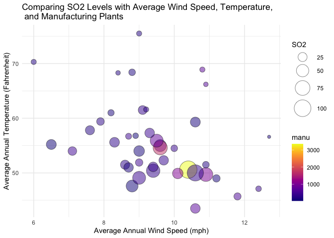

A Bubble Plot
================
Ellie Grace Moore
4/11/2022

``` r
USairpollution <- tibble(USairpollution)
head(USairpollution)
```

    ## # A tibble: 6 × 7
    ##     SO2  temp  manu popul  wind precip predays
    ##   <int> <dbl> <int> <int> <dbl>  <dbl>   <int>
    ## 1    46  47.6    44   116   8.8  33.4      135
    ## 2    11  56.8    46   244   8.9   7.77      58
    ## 3    24  61.5   368   497   9.1  48.3      115
    ## 4    47  55     625   905   9.6  41.3      111
    ## 5    11  47.1   391   463  12.4  36.1      166
    ## 6    31  55.2    35    71   6.5  40.8      148

To visualize multiple variables at once, we create a **bubble plot.**
The specific plot below plots the average annual wind speed and average
annual temperature for a city along with the number of manufacturing
enterprises, and the SO2 content in the air (micrograms per cubic
meter).

``` r
USairpollution %>%
  ggplot(aes(x = wind, y = temp, size = SO2, fill = manu)) +
        geom_point(alpha = 0.5, shape = 21, color = "black") +
        scale_size(range = c(2, 12)) +
        scale_fill_viridis(discrete = FALSE, option = "C") +
        ggtitle("Comparing SO2 Levels with Average Wind Speed, Temperature, \n and Manufacturing Plants") +
        xlab("Average Annual Wind Speed (mph)") + ylab("Average Annual Temperature (Fahrenheit)") +
        theme_minimal()
```


