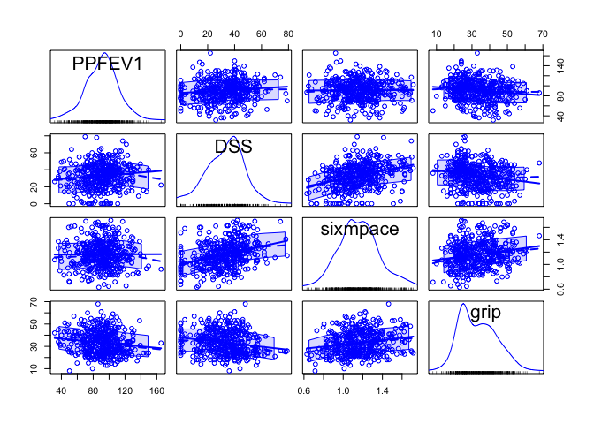

Visualizing Distributions
================
Ellie Grace Moore
2/16/2022

``` r
biomarker <- read_csv("Data/biomarker.csv")
```

    ## 
    ## ── Column specification ────────────────────────────────────────────────────────
    ## cols(
    ##   PPFEV1 = col_double(),
    ##   DSS = col_double(),
    ##   sixmpace = col_double(),
    ##   grip = col_double()
    ## )

``` r
X <- biomarker
S <- cov(X)
cor(X)
```

    ##                PPFEV1        DSS    sixmpace       grip
    ## PPFEV1    1.000000000  0.1101881 0.004765968 -0.1371021
    ## DSS       0.110188094  1.0000000 0.335573189 -0.1893596
    ## sixmpace  0.004765968  0.3355732 1.000000000  0.1957936
    ## grip     -0.137102057 -0.1893596 0.195793590  1.0000000

``` r
scatterplotMatrix(X)
```



None of the variables appear to be strongly related. However, of the
ones present we see that grip and sixmpace have the highest positive
correlation value of approximately 0.2 and grip and PPFEV1 have the
“highest” negative correlation with a value of 0.14.

#### (b)

``` r
x <- scale(X$sixmpace)
y <- scale(X$DSS)
plot(x,y)
```


``` r
lm <- lm(y ~ x)
summary(lm)
```

    ## 
    ## Call:
    ## lm(formula = y ~ x)
    ## 
    ## Residuals:
    ##     Min      1Q  Median      3Q     Max 
    ## -2.8189 -0.5986  0.0936  0.6239  3.1762 
    ## 
    ## Coefficients:
    ##               Estimate Std. Error t value Pr(>|t|)    
    ## (Intercept) -1.714e-17  4.456e-02   0.000        1    
    ## x            3.356e-01  4.461e-02   7.523 2.98e-13 ***
    ## ---
    ## Signif. codes:  0 '***' 0.001 '**' 0.01 '*' 0.05 '.' 0.1 ' ' 1
    ## 
    ## Residual standard error: 0.9431 on 446 degrees of freedom
    ## Multiple R-squared:  0.1126, Adjusted R-squared:  0.1106 
    ## F-statistic:  56.6 on 1 and 446 DF,  p-value: 2.975e-13

``` r
cor(x,y)
```

    ##           [,1]
    ## [1,] 0.3355732

``` r
cor(X$DSS, X$sixmpace)
```

    ## [1] 0.3355732

For each one standard deviation increase in `DSS`, `sixmpace` increases
by 0.34 standard deviations. This is the same value as the correlation
for the unstandardized variables.

#### (c)

According to the Q-Q Plots and histograms below, it appears that **DSS**
and **grip** least represent a normal distribution. However between
these two grip is arguably “less normal” being rather right skewed.

``` r
par(mfrow = c(2,2))
qqnorm(biomarker$PPFEV1, main = "Q-Q Plot for PPFEV1")
qqline(biomarker$PPFEV1)
qqnorm(biomarker$DSS, main = "Q-Q Plot for DSS")
qqline(biomarker$DSS)
qqnorm(biomarker$sixmpace, main = "Q-Q Plot for Sixmpace")
qqline(biomarker$sixmpace)
qqnorm(biomarker$grip, main = "Q-Q Plot for Grip")
qqline(biomarker$grip)
```


``` r
par(mfrow = c(2,2))
hist(biomarker$PPFEV1, main = " Histogram for PPFEV1")
hist(biomarker$DSS, main = "Histogram for DSS")
hist(biomarker$sixmpace, main = "Histogram for Sixmpace")
hist(biomarker$grip, main = "Histogram for Grip")
```


#### (d)

``` r
hist(biomarker[,2], main="DSS", xlab="DSS", freq=FALSE)
h=seq(0,80,by=1)
v=dnorm(h,mean(biomarker$DSS),sqrt(S[2,2]))
lines(h,v, col="red", lwd=3)
```


``` r
qnorm(0.25,mean=mean(biomarker$DSS), sd=sqrt(S[2,2])) ## 90th model percentile
```

    ## [1] 23.17863

``` r
qnorm(0.75,mean=mean(biomarker$DSS), sd=sqrt(S[2,2])) ## 90th model percentile
```

    ## [1] 42.89726

``` r
quantile(biomarker$DSS,0.25)
```

    ## 25% 
    ##  23

``` r
quantile(biomarker$DSS,0.75)
```

    ## 75% 
    ##  43

``` r
## 90th percentile of data
```

From the calculations above, we see that each of these percentiles are
almost the exact same for the fitted model and empirical data.

#### (e)

In my opinion, since the discrete data appears to follow a normal
distribution, I find it okay to use a continuous normal for the `DSS`
variable. This way we are able to learn more about the variable itself.

### 3. (a)

``` r
x=c(4,7,2,4,3,5,5,6,2,9,10)
y=c(1,5,8,7,3,4,5,7,5,3,10)
data=cbind(x,y)
data=data.frame(data)

hull=with(data, chull(x,y))

plot(y~x, data, main="Convex Hull of Data")
with(data, polygon(x[hull], y[hull], density=15, angle=30))
points(data$x[-hull], data$y[-hull], pch=16)
legend("topleft", legend=c("Interior (not part of hull)","Exterior (part of hull)"),pch=c(16,1))
```


\#\#\#\# (b)

Below are the covariance matrices for the entire data, and then for the
data without the hull. As one can suspect, the values in these matrices
are different for the whole dataset versus the one with the hull points
removed.

``` r
cov(data) #Whole dataset
```

    ##          x        y
    ## x 6.963636 1.545455
    ## y 1.545455 6.618182

``` r
cov(cbind(data$x[-hull], data$y[-hull])) #Without the points on the hull
```

    ##      [,1]     [,2]
    ## [1,]  2.0 0.800000
    ## [2,]  0.8 2.566667

#### (c)

Here is a nice visual that displays the Tukey depths for each point in
our dataset.

``` r
x <- c(4, 7, 2, 4, 3, 5, 5, 6, 2, 9, 10)
y <- c(1, 5, 8, 7, 3, 4, 5, 7, 5, 3, 10)
X <- as.matrix(cbind(x, y))

dpth <- array()
for (i in 1:length(x)) {
  dpth[i] = depth(X[i, ], X)
}

d2 <- dpth * dim(X)[1]
plot(X, pch = 16)
text(X[, 1], X[, 2], round(d2, 1), pos = 2)

wh <- which(d2 == max(d2))
points(X[wh, 1],
       X[wh, 2],
       col = "red",
       pch = 8,
       cex = 2)
```


#### (d)

From the plot above, we are able to see that the Tukey median is the
point **(5,5).**

#### (e)

``` r
library(aplpack)
bagplot(X)
```


According to the bagplot, there appears to be one outlier. The outlier
is the point **(10,10)**. We know it is an outlier because it passes the
“fence” which is a total of three times the distance from the Tukey
median to the convex hull.

### 4. (a)

This first plot is more “raw” code that allows me to play around with
different bandwidths. Then the next chunk of code outputs the optimal
bandwidth according to R (and thus giving us a much more viewer-friendly
kernel density estimate).

``` r
colleges <- read_csv("Data/colleges.csv")
```

    ## 
    ## ── Column specification ────────────────────────────────────────────────────────
    ## cols(
    ##   College = col_character(),
    ##   `US World and News Ranking` = col_double(),
    ##   TuitionState = col_double(),
    ##   TuitionOutState = col_double(),
    ##   TotalEnroll = col_double(),
    ##   Fall14Accep = col_double(),
    ##   Private = col_character(),
    ##   Selective = col_character(),
    ##   Setting = col_character(),
    ##   Endowment = col_double(),
    ##   FRR = col_double(),
    ##   Fewer20 = col_double(),
    ##   `4YrGradRate` = col_double(),
    ##   Fraternity = col_double(),
    ##   Sorority = col_double(),
    ##   Athletics = col_double(),
    ##   PercentAid = col_double()
    ## )

``` r
xgrid <- seq(5000,55000,by=1000)
gauss = function(x) 1/sqrt(2*pi) * exp(-(x^2)/2)

x=colleges$TuitionState
n=length(x)
h=1000
bumps=sapply(x, function(a) gauss((xgrid-a)/h)/(n*h))

plot(xgrid, rowSums(bumps), type="l", lwd=2, col="red", main = c("Bandwidth h=",h))
rug(x, lwd=6)
out=apply(bumps, 2, function(b) lines(xgrid, b))
```


``` r
plot(density(colleges$TuitionState), main = "Kernel Density Estimate of \n State Tuition", xlab = "Tuition Cost")
```


#### (b)

``` r
par(mfrow=c(1,2))
bagplot(colleges$`4YrGradRate`, xlab = "4YrGradRate", main = "Bagplot of Grad Rate")
bagplot(colleges$Fall14Accep, xlab = "Fall14Accep", main = "Bagplot of Fall Acceptance")
```


\#\#\#\# (c)

``` r
par(mfrow = c(1,2))
bagplot(colleges$Fraternity, xlab = "Fraternity", main = "Bagplot of Fraternity")
```

    ## [1] "Warning: NA elements have been exchanged by median values!!"

``` r
bagplot(colleges$Sorority, xlab = "Sorority", main = "Bagplot of Sorority")
```

    ## [1] "Warning: NA elements have been exchanged by median values!!"


We get the following message:
`"Warning: NA elements have been exchanged by median values!!"`. This is
because both data columns have entries with 0.

#### (d)

``` r
library(scatterplot3d)
with(colleges, scatterplot3d(PercentAid, Fall14Accep, Endowment, type="h", angle=70))
```


