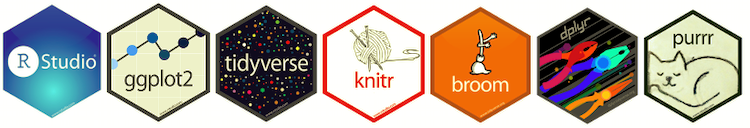

  

Throughout this website you will find reader-friendly copies of different coding projects I've completed. All code is done and compiled in R Markdown.

Topics include:

* Data Visualization
* Regression
* Statistical Learning
* Causal Inference
* Tidy Data

  

